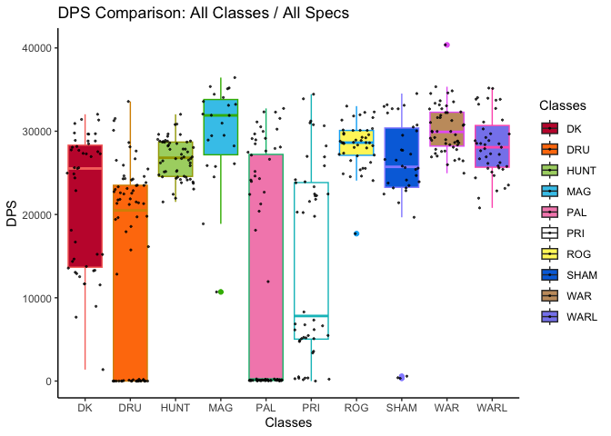
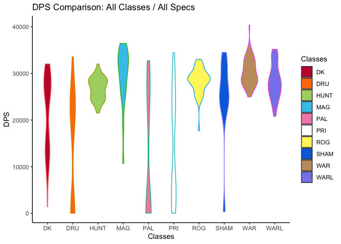
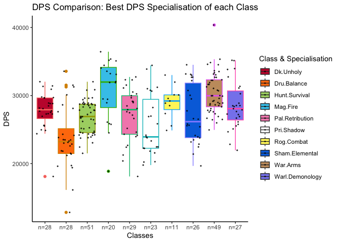
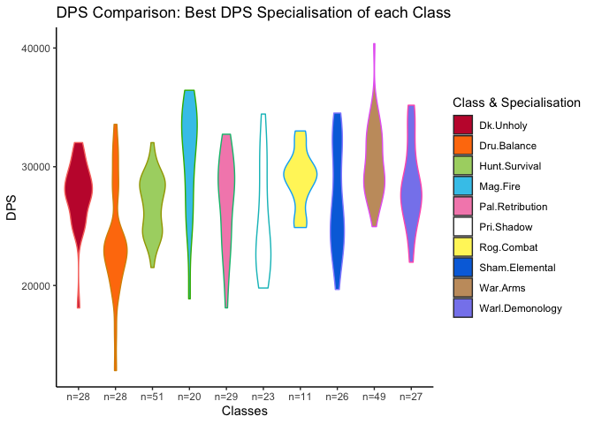
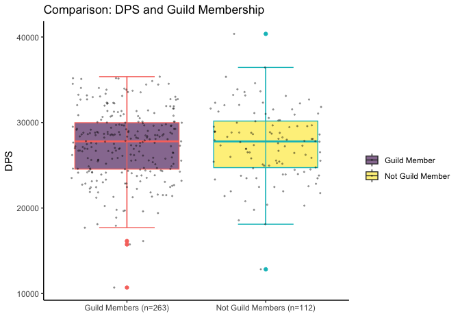
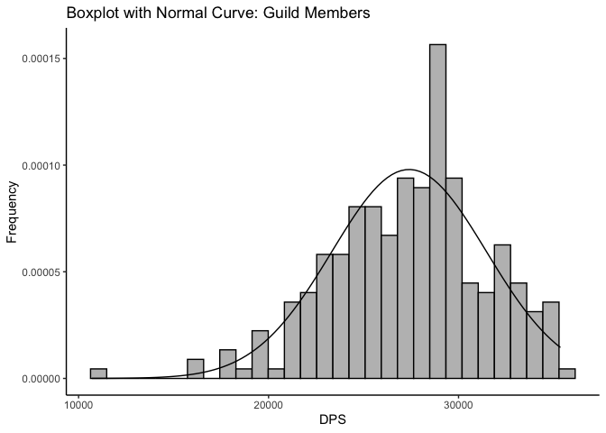
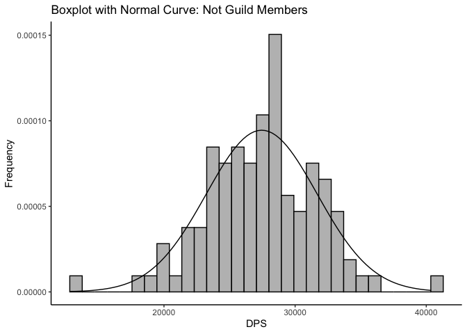

ApolloPy Descriptive Statistics
================

## DPS Comparisons for Baleroc 25 Heroic Difficulty

### Descriptive Statistics

``` r
# clear workspace
rm(list = ls())
```

``` r
# load data relating to Baleroc 25 hc for each class and spec
files <- list.files("./data_csv/", pattern = "Baleroc_25hc*")

# load data
data <- lapply(paste0("./data_csv/", files), read.csv)
data_dps <- lapply(data, function(x) {x$dps})
data_ilvl <- lapply(data, function(x) {x$avg_item_lvl})
data_fightlen <- lapply(data, function(x) {x$length})

# formatting class / spec
class_spec <- lapply(files, function(x) {strsplit(x, "_")[[1]][3:4]})
class <- lapply(class_spec, function(x) {x[1]})
spec <- lapply(class_spec, function(x) {sub(" ", "_", x[2])})
```

``` r
# append NAs to each vector if shorter than max_len
max_len <- max(unlist(lapply(data_dps, function(x) {length(x)})))

data_dps_na <- list()
for (i in seq_along(data_dps)) {
 if (length(data_dps[[i]])<max_len) {
   data_dps_na[[i]] <- c(data_dps[[i]], rep(NA_character_, max_len-length(data_dps[[i]])))
 } else {
   data_dps_na[[i]] <- data_dps[[i]]
 }
}

data_df <- data.frame(x = rep(NA_character_, max_len))

# append columns
for (i in seq_along(data_dps_na)) {
 data_df[, i] <- data_dps_na[[i]]
}
```

``` r
# rename columns
class_spec_2 <- list()
for (i in seq_along(class)) {
  class_spec_2[i] <- paste0(class[[i]], ".", spec[[i]])
}
colnames(data_df) <- class_spec_2
```

``` r
suppressPackageStartupMessages(library(tidyverse))

data_df <- plyr::colwise(as.numeric)(data_df)
```

``` r
# convert wide to long format (ignore NAs)
data_df_long <- data_df %>%
  gather(key = "class_spec", value = "DPS") %>%
  na.omit() %>%
  mutate()
```

``` r
data_df_long$class <- lapply(data_df_long$class_spec, function(x) {strsplit(x, ".", fixed = TRUE)[[1]][1]})
data_df_long$class <- lapply(data_df_long$class, toupper)

data_df_long$spec <- lapply(data_df_long$class_spec, function(x) {strsplit(x, ".", fixed = TRUE)[[1]][2]})
data_df_long$spec <- lapply(data_df_long$spec, toupper)

# trim leading white space
data_df_long$class <- as.character(trimws(data_df_long$class))
data_df_long$spec <- as.character(trimws(data_df_long$spec))
```

``` r
library(ggplot2)
```

``` r
# Boxplot
# Order: DK, Druid, Hunter, Mage, Paladin, Priest, Rogue, Shaman, Warrior, Warlock
class_colors <- c("#C41E3A", "#FF7C0A", "#AAD372", "#3FC7EB", "#F48CBA", "#FFFFFF", "#FFF468", "#0070DD", "#C69B6D", "#8788EE")

data_df_long %>%
  ggplot(aes(x=class, y=DPS, fill = class, color = class)) +
  geom_boxplot() + 
  geom_jitter(color="black", size=0.4, alpha=0.7) +
  scale_fill_manual(values=class_colors) +
  ggtitle("DPS Comparison: All Classes / All Specs") +
  xlab("Classes") +
  labs(fill="Classes") +
  guides(color=FALSE) +
  theme_classic()
```

    ## Warning: The `<scale>` argument of `guides()` cannot be `FALSE`. Use "none" instead as
    ## of ggplot2 3.3.4.
    ## This warning is displayed once every 8 hours.
    ## Call `lifecycle::last_lifecycle_warnings()` to see where this warning was
    ## generated.

<!-- -->

``` r
# Violin Plot
data_df_long %>%
  ggplot(aes(x=class, y=DPS, fill = class, color = class)) +
  geom_violin() +
  scale_fill_manual(values=class_colors) +
  ggtitle("DPS Comparison: All Classes / All Specs") +
  xlab("Classes") +
  labs(fill="Classes") +
  guides(color=FALSE) +
  theme_classic()
```

<!-- -->

``` r
suppressPackageStartupMessages(library(pastecs))
print(format(stat.desc(data_df), scientific=FALSE, digits=2))
```

    ## Warning in qt((0.5 + p/2), (Nbrval - 1)): NaNs produced

    ## Warning in qt((0.5 + p/2), (Nbrval - 1)): NaNs produced

    ## Warning in qt((0.5 + p/2), (Nbrval - 1)): NaNs produced

    ## Warning in qt((0.5 + p/2), (Nbrval - 1)): NaNs produced

    ##                 Dk.Blood Dk.Frost Dk.Unholy Dru.Balance Dru.Feral_Combat
    ## nbr.val            18.00        1      28.0       28.00            18.00
    ## nbr.null            0.00        0       0.0        0.00             0.00
    ## nbr.na             33.00       50      23.0       23.00            33.00
    ## min              1375.34    22866   18108.8    12835.06         15745.17
    ## max             16693.88    22866   32033.6    33568.00         26688.96
    ## range           15318.54        0   13924.9    20732.95         10943.78
    ## sum            221378.56    22866  776789.9   664076.37        406496.96
    ## median          13148.99    22866   27918.9    23221.53         22644.88
    ## mean            12298.81    22866   27742.5    23717.01         22583.16
    ## SE.mean           820.35       NA     527.2      867.69           727.22
    ## CI.mean.0.95     1730.79      NaN    1081.8     1780.35          1534.30
    ## var          12113530.15       NA 7782814.6 21080728.69       9519258.72
    ## std.dev          3480.45       NA    2789.8     4591.38          3085.33
    ## coef.var            0.28       NA       0.1        0.19             0.14
    ##              Dru.Restoration Hunt.Beast_Mastery Hunt.Marksmanship Hunt.Survival
    ## nbr.val                   28                4.0                 1         51.00
    ## nbr.null                  21                0.0                 0          0.00
    ## nbr.na                    23               47.0                50          0.00
    ## min                        0            21957.4             25160      21511.43
    ## max                      206            28043.8             25160      32031.64
    ## range                    206             6086.4                 0      10520.22
    ## sum                      851           102895.6             25160    1369179.90
    ## median                     0            26447.2             25160      26921.91
    ## mean                      30            25723.9             25160      26846.66
    ## SE.mean                   12             1314.9                NA        336.86
    ## CI.mean.0.95              24             4184.5               NaN        676.61
    ## var                     3716          6915467.3                NA    5787354.05
    ## std.dev                   61             2629.7                NA       2405.69
    ## coef.var                   2                0.1                NA          0.09
    ##              Mag.Arcane    Mag.Fire   Mag.Frost Pal.Holy Pal.Protection
    ## nbr.val               1       20.00       2.000    38.00              1
    ## nbr.null              0        0.00       0.000     0.00              0
    ## nbr.na               50       31.00      49.000    13.00             50
    ## min               10702    18876.53   28240.969    17.86          11944
    ## max               10702    36440.81   30969.644   251.49          11944
    ## range                 0    17564.28    2728.675   233.63              0
    ## sum               10702   615398.90   59210.613  3952.02          11944
    ## median            10702    31986.88   29605.307    90.54          11944
    ## mean              10702    30769.95   29605.307   104.00          11944
    ## SE.mean              NA     1022.42    1364.337     9.00             NA
    ## CI.mean.0.95        NaN     2139.94   17335.550    18.23            NaN
    ## var                  NA 20906657.94 3722833.082  3077.03             NA
    ## std.dev              NA     4572.38    1929.464    55.47             NA
    ## coef.var             NA        0.15       0.065     0.53             NA
    ##              Pal.Retribution Pri.Discipline Pri.Holy  Pri.Shadow
    ## nbr.val                29.00          17.00     8.00       23.00
    ## nbr.null                0.00           0.00     1.00        0.00
    ## nbr.na                 22.00          34.00    43.00       28.00
    ## min                 18114.77        3374.99     0.00    19786.76
    ## max                 32737.34        8297.89   505.12    34437.24
    ## range               14622.57        4922.90   505.12    14650.48
    ## sum                788121.67       96320.18  2241.76   588340.40
    ## median              27927.51        5470.58   308.38    23929.17
    ## mean                27176.61        5665.89   280.22    25580.02
    ## SE.mean               712.11         309.12    53.90      940.17
    ## CI.mean.0.95         1458.69         655.31   127.45     1949.80
    ## var              14705851.05     1624479.23 23240.04 20330249.72
    ## std.dev              3834.82        1274.55   152.45     4508.91
    ## coef.var                0.14           0.22     0.54        0.18
    ##              Rog.Assassination  Rog.Combat Rog.Subtlety Sham.Elemental
    ## nbr.val                   29.0      11.000         4.00          26.00
    ## nbr.null                   0.0       0.000         0.00           0.00
    ## nbr.na                    22.0      40.000        47.00          25.00
    ## min                    17701.2   24880.797     24070.34       19663.02
    ## max                    32308.8   33013.351     31819.84       34522.01
    ## range                  14607.6    8132.554      7749.49       14858.99
    ## sum                   817511.6  319151.907    110525.27      709887.26
    ## median                 28605.4   29203.500     27317.54       26165.99
    ## mean                   28190.1   29013.810     27631.32       27303.36
    ## SE.mean                  528.9     735.975      1780.92         853.58
    ## CI.mean.0.95            1083.3    1639.853      5667.69        1757.99
    ## var                  8110959.9 5958243.658  12686731.69    18943702.33
    ## std.dev                 2848.0    2440.951      3561.84        4352.44
    ## coef.var                   0.1       0.084         0.13           0.16
    ##              Sham.Enhancement Sham.Restoration    War.Arms   War.Fury
    ## nbr.val                  5.00             3.00      49.000      2.000
    ## nbr.null                 0.00             0.00       0.000      0.000
    ## nbr.na                  46.00            48.00       2.000     49.000
    ## min                  23186.06           321.99   24954.371  27010.949
    ## max                  30502.94           579.53   40365.807  28374.489
    ## range                 7316.88           257.53   15411.436   1363.540
    ## sum                 133333.98          1300.15 1488741.595  55385.439
    ## median               27250.24           398.63   29973.519  27692.719
    ## mean                 26666.80           433.38   30382.482  27692.719
    ## SE.mean               1268.68            76.35     426.319    681.770
    ## CI.mean.0.95          3522.42           328.49     857.172   8662.711
    ## var                8047739.71         17486.63 8905652.090 929621.075
    ## std.dev               2836.85           132.24    2984.234    964.169
    ## coef.var                 0.11             0.31       0.098      0.035
    ##              Warl.Affliction Warl.Demonology Warl.Destruction
    ## nbr.val                13.00           27.00             3.00
    ## nbr.null                0.00            0.00             0.00
    ## nbr.na                 38.00           24.00            48.00
    ## min                 20793.39        21957.98         24394.20
    ## max                 33834.97        35182.79         34037.37
    ## range               13041.58        13224.81          9643.17
    ## sum                359945.54       770162.86         87295.64
    ## median              26230.06        28073.34         28864.07
    ## mean                27688.12        28524.55         29098.55
    ## SE.mean              1176.70          671.31          2786.21
    ## CI.mean.0.95         2563.82         1379.89         11988.09
    ## var              18000210.94     12167611.59      23288902.09
    ## std.dev              4242.67         3488.21          4825.86
    ## coef.var                0.15            0.12             0.17

``` r
# identifying highest DPS spec for each class
classes_unique <- unique(unlist(class))
max_dps_list <- list()
max_dps_ind <- list()

for (c in classes_unique) {
  max_dps_spec <- which.max(plyr::colwise(max, na.rm=TRUE)(data_df[, grep(pattern=paste0(c, ".*"), names(data_df))]))
  max_dps_ind <- append(max_dps_ind, max_dps_spec)
  
  max_dps_val <- plyr::colwise(max, na.rm=TRUE)(data_df[, grep(pattern=paste0(c, ".*"), names(data_df))])
  max_dps_list <- append(max_dps_list, max_dps_val)
}
```

``` r
max_dps_spec_names <- names(max_dps_ind)

# report 
cat("Max. DPS indices for each class:\n\n")
```

    ## Max. DPS indices for each class:

``` r
print(unlist(max_dps_ind))
```

    ##       Dk.Unholy     Dru.Balance   Hunt.Survival        Mag.Fire Pal.Retribution 
    ##               3               1               3               2               3 
    ##      Pri.Shadow      Rog.Combat  Sham.Elemental        War.Arms Warl.Demonology 
    ##               3               2               1               1               2

``` r
cat("\nMax. DPS values for each class.spec:\n\n")
```

    ## 
    ## Max. DPS values for each class.spec:

``` r
print(unlist(max_dps_list))
```

    ##           Dk.Blood           Dk.Frost          Dk.Unholy        Dru.Balance 
    ##         16693.8850         22865.8390         32033.6231         33568.0014 
    ##   Dru.Feral_Combat    Dru.Restoration Hunt.Beast_Mastery  Hunt.Marksmanship 
    ##         26688.9593           206.3129         28043.7807         25159.7785 
    ##      Hunt.Survival         Mag.Arcane           Mag.Fire          Mag.Frost 
    ##         32031.6431         10702.4115         36440.8133         30969.6440 
    ##           Pal.Holy     Pal.Protection    Pal.Retribution     Pri.Discipline 
    ##           251.4882         11943.7063         32737.3422          8297.8865 
    ##           Pri.Holy         Pri.Shadow  Rog.Assassination         Rog.Combat 
    ##           505.1233         34437.2401         32308.8044         33013.3510 
    ##       Rog.Subtlety     Sham.Elemental   Sham.Enhancement   Sham.Restoration 
    ##         31819.8355         34522.0132         30502.9383           579.5266 
    ##           War.Arms           War.Fury    Warl.Affliction    Warl.Demonology 
    ##         40365.8068         28374.4894         33834.9698         35182.7931 
    ##   Warl.Destruction    Warl.Affliction    Warl.Demonology   Warl.Destruction 
    ##         34037.3706         33834.9698         35182.7931         34037.3706

``` r
# number of cases for each sepecialisation (N)
cat("\nNumber of cases for each class.spec:\n\n")
```

    ## 
    ## Number of cases for each class.spec:

``` r
spec_number_cases <- colSums(! is.na(data_df))
print(spec_number_cases)
```

    ##           Dk.Blood           Dk.Frost          Dk.Unholy        Dru.Balance 
    ##                 18                  1                 28                 28 
    ##   Dru.Feral_Combat    Dru.Restoration Hunt.Beast_Mastery  Hunt.Marksmanship 
    ##                 18                 28                  4                  1 
    ##      Hunt.Survival         Mag.Arcane           Mag.Fire          Mag.Frost 
    ##                 51                  1                 20                  2 
    ##           Pal.Holy     Pal.Protection    Pal.Retribution     Pri.Discipline 
    ##                 38                  1                 29                 17 
    ##           Pri.Holy         Pri.Shadow  Rog.Assassination         Rog.Combat 
    ##                  8                 23                 29                 11 
    ##       Rog.Subtlety     Sham.Elemental   Sham.Enhancement   Sham.Restoration 
    ##                  4                 26                  5                  3 
    ##           War.Arms           War.Fury    Warl.Affliction    Warl.Demonology 
    ##                 49                  2                 13                 27 
    ##   Warl.Destruction 
    ##                  3

``` r
# max DPS specs
max_dps_spec_number_cases <- spec_number_cases[max_dps_spec_names]
data_df_max_dps <- data_df[max_dps_spec_names]
```

``` r
# convert to long format
data_df_max_dps_long <- data_df_max_dps %>%
  gather(key = "class_spec", value = "DPS") %>%
  na.omit() %>%
  mutate()

data_df_max_dps_long$class <- lapply(data_df_max_dps_long$class_spec, function(x) {strsplit(x, ".", fixed = TRUE)[[1]][1]})
data_df_max_dps_long$class <- lapply(data_df_max_dps_long$class, toupper)

data_df_max_dps_long$spec <- lapply(data_df_max_dps_long$class_spec, function(x) {strsplit(x, ".", fixed = TRUE)[[1]][2]})
data_df_max_dps_long$spec <- lapply(data_df_max_dps_long$spec, toupper)

# trim leading white space
data_df_max_dps_long$class <- as.character(trimws(data_df_max_dps_long$class))
data_df_max_dps_long$spec <- as.character(trimws(data_df_max_dps_long$spec))
```

``` r
# relabel axes
data_df_max_dps_long_classes <- unique(data_df_max_dps_long$class)
data_df_max_dps_long_specs <- unique(data_df_max_dps_long$spec)

new_x_axis <- lapply(max_dps_spec_number_cases, function(x) paste0("n=", x))
new_legend <- mapply(function(x, y) {paste(x, y, sep=": ")},
                     x=data_df_max_dps_long_classes,
                     y=data_df_max_dps_long_specs)
```

``` r
new_x_axis <- unname(unlist(new_x_axis))
data_df_max_dps_long %>% 
  ggplot( aes(x=class, y=DPS, fill=class_spec, color=class_spec)) +
  geom_boxplot() +
  geom_jitter(color="black", size=0.4, alpha=0.7) +
  scale_fill_manual(values=class_colors) +
  ggtitle("DPS Comparison: Best DPS Specialisation of each Class") +
  xlab("Classes") +
  scale_x_discrete(labels=new_x_axis) +
  labs(fill="Class & Specialisation") +
  guides(color=FALSE) +
  theme_classic()
```

<!-- -->

``` r
data_df_max_dps_long %>% 
  ggplot( aes(x=class, y=DPS, fill=class_spec, color=class_spec)) +
  geom_violin() +
  scale_fill_manual(values=class_colors) +
  ggtitle("DPS Comparison: Best DPS Specialisation of each Class") +
  xlab("Classes") +
  scale_x_discrete(labels=new_x_axis) +
  labs(fill="Class & Specialisation") +
  guides(color=FALSE) +
  theme_classic()
```

<!-- -->

``` r
# create a full dataframe
data_guild <- lapply(data, function(x) {x$guild})

df_full_long          <- data_df_long[,1:2]
df_full_long$ilvl     <- unlist(data_ilvl)
df_full_long$fightlen <- unlist(data_fightlen)
df_full_long$guild    <- unlist(data_guild)

df_full_long$guild <- ifelse(df_full_long$guild=="", NA, df_full_long$guild)
```

``` r
# remove non-dps specs
non_dps <- c("Dk.Blood", "Dru.Restoration", "Pal.Holy", "Pal.Protection", "Pri.Discipline", "Pri.Holy", "Sham.Restoration")
df_dps_full_long <- df_full_long %>% dplyr::filter(!(class_spec %in% non_dps))
```

``` r
# compare damage of characters in a guild vs. characters in no guild
guild_dps <- df_dps_full_long$DPS[!is.na(df_dps_full_long$guild)]
noguild_dps <- df_dps_full_long$DPS[is.na(df_dps_full_long$guild)]
```

``` r
mean_dps_guild <- mean(guild_dps)
mean_dps_noguild <- mean(noguild_dps)

sd_dps_guild <- sd(guild_dps)
sd_dps_noguild <- sd(noguild_dps)

max_dps_guild <- max(guild_dps)
max_dps_noguild <- max(noguild_dps)

min_dps_guild <- min(guild_dps)
min_dps_noguild <- min(noguild_dps)

cat(paste0("Member of a guild:\nN = ",length(guild_dps), 
             "\nMean DPS = ", round(mean_dps_guild, 2),
             "\nSD = ", round(sd_dps_guild, 2),
             "\nRange = ", round(min_dps_guild, 2), " - ", round(max_dps_guild, 2)
             ))
```

    ## Member of a guild:
    ## N = 263
    ## Mean DPS = 27400.78
    ## SD = 4073.04
    ## Range = 10702.41 - 35362.39

``` r
cat(paste0("\n\nNon-Members:\nN = ",length(noguild_dps), 
             "\nMean DPS = ", round(mean_dps_noguild, 2),
             "\nSD = ", round(sd_dps_noguild, 2),
             "\nRange = ", round(min_dps_noguild, 2), " - ", round(max_dps_noguild, 2)
             ))
```

    ## 
    ## 
    ## Non-Members:
    ## N = 112
    ## Mean DPS = 27453.35
    ## SD = 4221.96
    ## Range = 12835.06 - 40365.81

``` r
# boxplots
guild_bxplt_df <- data.frame(
  guild=guild_dps,
  noguild=append(noguild_dps, rep(NA, length(guild_dps)-length(noguild_dps)))
)
guild_bxplt_df <- guild_bxplt_df %>% 
  gather(key="guild_factor", value="DPS") %>% 
  mutate()

guild_bxplt_df <- guild_bxplt_df %>% dplyr::filter(DPS>1000)
```

``` r
library(viridis)
```

    ## Loading required package: viridisLite

``` r
guild_bxplt_df %>% 
  ggplot( aes(x=guild_factor, y=DPS, fill=guild_factor, color=guild_factor)) +
  geom_boxplot() +
  stat_boxplot(geom="errorbar", width=0.4) +
  geom_jitter(color="black", size=0.4, alpha=0.3) +
  scale_fill_viridis(discrete = TRUE, alpha=0.6, labels=c("Guild Member", "Not Guild Member")) +
  ggtitle("Comparison: DPS and Guild Membership") +
  xlab("") +
  scale_x_discrete(labels=c(paste0("Guild Members (n=", length(guild_dps), ")"), 
                            paste0("Not Guild Members (n=", length(noguild_dps), ")"))) + 
  labs(fill="") +
  guides(color=FALSE) +
  theme_classic()
```

<!-- -->

``` r
# histogram with normal distribution laid over

guild_bxplt_df_guild <- data.frame(x=guild_bxplt_df$DPS[guild_bxplt_df=="guild"])
guild_bxplt_df_guild %>% 
  ggplot( aes(x=x)) +
  geom_histogram( aes(y=..density..),
    color="black", fill="grey") +
  stat_function(fun = dnorm, args = list(mean=mean(guild_bxplt_df_guild$x), sd=sd(guild_bxplt_df_guild$x))) +
  ggtitle("Boxplot with Normal Curve: Guild Members") +
  ylab("Frequency") +
  xlab("DPS") +
  theme_classic() 
```

    ## Warning: The dot-dot notation (`..density..`) was deprecated in ggplot2 3.4.0.
    ## ℹ Please use `after_stat(density)` instead.
    ## This warning is displayed once every 8 hours.
    ## Call `lifecycle::last_lifecycle_warnings()` to see where this warning was
    ## generated.

    ## `stat_bin()` using `bins = 30`. Pick better value with `binwidth`.

<!-- -->

``` r
# histogram with normal distribution laid over

guild_bxplt_df_guild <- data.frame(x=guild_bxplt_df$DPS[guild_bxplt_df=="noguild"])
guild_bxplt_df_guild %>% 
  ggplot( aes(x=x)) +
  geom_histogram( aes(y=..density..),
    color="black", fill="grey") +
  stat_function(fun = dnorm, args = list(mean=mean(guild_bxplt_df_guild$x), sd=sd(guild_bxplt_df_guild$x))) +
  ggtitle("Boxplot with Normal Curve: Not Guild Members") +
  ylab("Frequency") +
  xlab("DPS") +
  theme_classic() 
```

    ## `stat_bin()` using `bins = 30`. Pick better value with `binwidth`.

<!-- -->

``` r
# Bayesian t-test: do both samples have similar means
suppressPackageStartupMessages(library(BayesFactor))
ttestBF(x=guild_bxplt_df$DPS[guild_bxplt_df$guild_factor=="guild"], y=guild_bxplt_df$DPS[guild_bxplt_df$guild_factor=="noguild"])
```

    ## Bayes factor analysis
    ## --------------
    ## [1] Alt., r=0.707 : 0.1250592 ±0.11%
    ## 
    ## Against denominator:
    ##   Null, mu1-mu2 = 0 
    ## ---
    ## Bayes factor type: BFindepSample, JZS

Bayes Factor = 0.1251 +/- 0.11. Different means are very unlikely. /
Means are very likely to be similar.

``` r
# test equal variances (Levene's Test)
library(car)
```

    ## Loading required package: carData

    ## 
    ## Attaching package: 'car'

    ## The following object is masked from 'package:dplyr':
    ## 
    ##     recode

    ## The following object is masked from 'package:purrr':
    ## 
    ##     some

``` r
leveneTest(DPS ~ factor(guild_factor), guild_bxplt_df)
```

    ## Levene's Test for Homogeneity of Variance (center = median)
    ##        Df F value Pr(>F)
    ## group   1  0.0652 0.7985
    ##       373
