ApolloPy ANOVA
================

## DPS Comparisons for Baleroc 25 Heroic Difficulty

### ANOVA / linear models

``` r
# clear workspace
rm(list = ls())

library(tidyverse)
```

    ## ── Attaching core tidyverse packages ──────────────────────── tidyverse 2.0.0 ──
    ## ✔ dplyr     1.1.1     ✔ readr     2.1.4
    ## ✔ forcats   1.0.0     ✔ stringr   1.5.0
    ## ✔ ggplot2   3.4.2     ✔ tibble    3.2.1
    ## ✔ lubridate 1.9.2     ✔ tidyr     1.3.0
    ## ✔ purrr     1.0.1     
    ## ── Conflicts ────────────────────────────────────────── tidyverse_conflicts() ──
    ## ✖ dplyr::filter() masks stats::filter()
    ## ✖ dplyr::lag()    masks stats::lag()
    ## ℹ Use the conflicted package (<http://conflicted.r-lib.org/>) to force all conflicts to become errors

``` r
library(ggpubr)
suppressPackageStartupMessages(library(rstatix))
```

``` r
# load data relating to Baleroc 25 hc for each class and spec
files <- list.files("./data_csv/", pattern = "Baleroc_25hc*")

# load data
data           <- lapply(paste0("./data_csv/", files), read.csv)
data_dps       <- lapply(data, function(x) {x$dps})
data_ilvl      <- lapply(data, function(x) {x$avg_item_lvl})
data_fightlen  <- lapply(data, function(x) {x$length})
data_guild     <- lapply(data, function(x) {x$guild})

# get class + spec from filename
class_spec   <- lapply(files, function(x) {strsplit(x, "_")[[1]][3:4]})
class        <- lapply(class_spec, function(x) {x[1]})
spec         <- lapply(class_spec, function(x) {sub(" ", "_", x[2])})
class_spec_2 <- mapply(function(x,y) paste0(x, ".", y), x=class, y=spec)
```

``` r
data_guild <- ifelse(unlist(data_guild)=="", "No Guild", unlist(data_guild))
```

``` r
# append NAs to each vector if shorter than max_len
max_len <- max(unlist(lapply(data_dps, function(x) {length(x)})))

data_dps_na <- list()
for (i in seq_along(data_dps)) {
 if (length(data_dps[[i]])<max_len) {
   data_dps_na[[i]] <- c(data_dps[[i]], rep(NA_character_, max_len-length(data_dps[[i]])))
 } else {
   data_dps_na[[i]] <- data_dps[[i]]
 }
}

df_wide <- data.frame(x = rep(NA_character_, max_len))

# append columns
for (i in seq_along(data_dps_na)) {
 df_wide[, i] <- data_dps_na[[i]]
}

colnames(df_wide) <- class_spec_2

df <- df_wide %>% 
  gather(key="class_spec", value="DPS") %>% 
  na.omit() %>% 
  mutate()
```

``` r
# formatting DF

df$DPS       <- as.numeric(df$DPS)
df$ID        <- 1:length(unlist(data_dps))
df$itemlvl   <- as.numeric(unlist(data_ilvl))
df$fight_len <- as.numeric(unlist(data_fightlen))
df$guild     <- data_guild

df$class_spec <- factor(df$class_spec)
df$ID         <- factor(df$ID)
df$guild      <- factor(df$guild)
```

## Comparing DPS depending on each class’ highest ranking DPS specialization

``` r
# remove non-dps specs
non_dps <- c("Dk.Blood", "Dru.Restoration", "Pal.Holy", "Pal.Protection", "Pri.Discipline", "Pri.Holy", "Sham.Restoration")
df_dps <- df %>% dplyr::filter(!(class_spec %in% non_dps))
```

``` r
# summary statistics
df %>%
  group_by(class_spec) %>%
  get_summary_stats(DPS, type="mean_sd")
```

    ## # A tibble: 29 × 5
    ##    class_spec         variable     n    mean     sd
    ##    <fct>              <fct>    <dbl>   <dbl>  <dbl>
    ##  1 Dk.Blood           DPS         18 12299.  3480. 
    ##  2 Dk.Frost           DPS          1 22866.    NA  
    ##  3 Dk.Unholy          DPS         28 27742.  2790. 
    ##  4 Dru.Balance        DPS         28 23717.  4591. 
    ##  5 Dru.Feral_Combat   DPS         18 22583.  3085. 
    ##  6 Dru.Restoration    DPS         28    30.4   61.0
    ##  7 Hunt.Beast_Mastery DPS          4 25724.  2630. 
    ##  8 Hunt.Marksmanship  DPS          1 25160.    NA  
    ##  9 Hunt.Survival      DPS         51 26847.  2406. 
    ## 10 Mag.Arcane         DPS          1 10702.    NA  
    ## # … with 19 more rows

## Comparing each classes’ highest DPS talent specialisation

``` r
# identifying highest DPS spec for each class
classes_unique <- unique(unlist(class))
max_dps_ind <- list()

for (c in classes_unique) {
  
  max_dps_spec <- df$class_spec[df$DPS==max(df$DPS[grep(pattern=paste0(c, ".*"), df$class_spec)])]
  max_dps_ind <- append(max_dps_ind, max_dps_spec)
  
}
```

``` r
df_max_dps <- df[df$class_spec %in% as.character(max_dps_ind),]
```

``` r
library(ggplot2)

class_colors <- c("#C41E3A", "#FF7C0A", "#AAD372", "#3FC7EB", "#F48CBA", "#FFFFFF", "#FFF468", "#0070DD", "#C69B6D", "#8788EE")
new_x_axis <- c(paste0("n=", length(df_max_dps[df_max_dps$class_spec=="Dk.Unholy",]$class_spec)),
                paste0("n=", length(df_max_dps[df_max_dps$class_spec=="Dru.Balance",]$class_spec)),
                paste0("n=", length(df_max_dps[df_max_dps$class_spec=="Hunt.Survival",]$class_spec)),
                paste0("n=", length(df_max_dps[df_max_dps$class_spec=="Mag.Fire",]$class_spec)),
                paste0("n=", length(df_max_dps[df_max_dps$class_spec=="Pal.Retribution",]$class_spec)),
                paste0("n=", length(df_max_dps[df_max_dps$class_spec=="Pri.Shadow",]$class_spec)),
                paste0("n=", length(df_max_dps[df_max_dps$class_spec=="Rog.Combat",]$class_spec)),
                paste0("n=", length(df_max_dps[df_max_dps$class_spec=="Sham.Elemental",]$class_spec)),
                paste0("n=", length(df_max_dps[df_max_dps$class_spec=="War.Arms",]$class_spec)),
                paste0("n=", length(df_max_dps[df_max_dps$class_spec=="Warl.Demonology",]$class_spec))
)
                      
df_max_dps %>% 
  ggplot( aes(x=class_spec, y=DPS, fill=class_spec)) +
  stat_boxplot(geom="errorbar", width=0.2) +
  geom_boxplot() +
  geom_jitter(color="black", size=0.4, alpha=0.4) +
  scale_fill_manual(values=class_colors) +
  ggtitle("All Classes \n(highest DPS specs)") +
  xlab("Classes") +
  scale_x_discrete(labels=new_x_axis) +
  theme_minimal()
```

<!-- -->

``` r
# QQ Plots
ggqqplot(df_max_dps, "DPS", facet.by="class_spec", size=0.3, color="black")
```

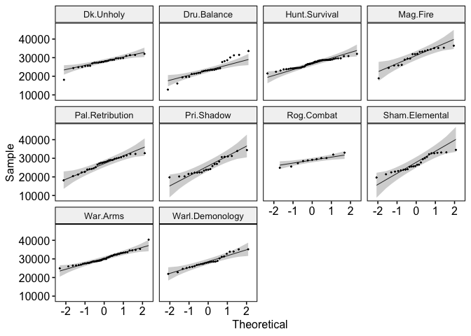<!-- -->

``` r
model <- lm(DPS ~ class_spec, data=df_max_dps)
shapiro.test(residuals(model))
```

    ## 
    ##  Shapiro-Wilk normality test
    ## 
    ## data:  residuals(model)
    ## W = 0.99446, p-value = 0.3699

``` r
plot(model, 1)
```

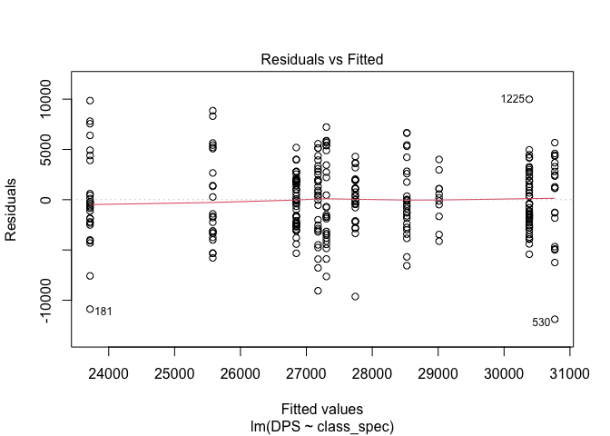<!-- -->

``` r
df_max_dps %>% levene_test(DPS ~ class_spec)
```

    ## # A tibble: 1 × 4
    ##     df1   df2 statistic       p
    ##   <int> <int>     <dbl>   <dbl>
    ## 1     9   282      2.51 0.00877

``` r
# ANOVA results
res.aov <- anova_test(data=df_max_dps, dv=DPS, between=class_spec)
get_anova_table(res.aov)
```

    ## ANOVA Table (type II tests)
    ## 
    ##       Effect DFn DFd      F        p p<.05   ges
    ## 1 class_spec   9 282 10.223 1.23e-13     * 0.246

``` r
# ANOVA using Welch's statistic with sig. Levene's Test
res.aov.welch <- welch_anova_test(data=df_max_dps, formula=DPS ~ class_spec)
get_anova_table(res.aov.welch)
```

    ## # A tibble: 1 × 7
    ##   .y.       n statistic   DFn   DFd             p method     
    ## * <chr> <int>     <dbl> <dbl> <dbl>         <dbl> <chr>      
    ## 1 DPS     292      8.99     9  90.7 0.00000000139 Welch ANOVA

``` r
# post hoc comparisons Bonferroni corrected
post_hoc <- df_max_dps %>% 
  pairwise_t_test(
    DPS ~ class_spec,
    paired=FALSE,
    p.adjust.method="bonferroni"
  )
post_hoc
```

    ## # A tibble: 45 × 9
    ##    .y.   group1        group2          n1    n2        p p.sig…¹   p.adj p.adj…²
    ##  * <chr> <chr>         <chr>        <int> <int>    <dbl> <chr>     <dbl> <chr>  
    ##  1 DPS   Dk.Unholy     Dru.Balance     28    28 3.37e- 5 ****    1.52e-3 **     
    ##  2 DPS   Dk.Unholy     Hunt.Surviv…    28    51 2.87e- 1 ns      1   e+0 ns     
    ##  3 DPS   Dru.Balance   Hunt.Surviv…    28    51 2.38e- 4 ***     1.07e-2 *      
    ##  4 DPS   Dk.Unholy     Mag.Fire        28    20 4.11e- 3 **      1.85e-1 ns     
    ##  5 DPS   Dru.Balance   Mag.Fire        28    20 8.88e-11 ****    4   e-9 ****   
    ##  6 DPS   Hunt.Survival Mag.Fire        51    20 4.22e- 5 ****    1.9 e-3 **     
    ##  7 DPS   Dk.Unholy     Pal.Retribu…    28    29 5.51e- 1 ns      1   e+0 ns     
    ##  8 DPS   Dru.Balance   Pal.Retribu…    28    29 3.08e- 4 ***     1.39e-2 *      
    ##  9 DPS   Hunt.Survival Pal.Retribu…    51    29 6.92e- 1 ns      1   e+0 ns     
    ## 10 DPS   Mag.Fire      Pal.Retribu…    20    29 6.26e- 4 ***     2.82e-2 *      
    ## # … with 35 more rows, and abbreviated variable names ¹​p.signif, ²​p.adj.signif

``` r
library(ggsignif)

# create list of vectors containing all sig. comparisons
group1      <- post_hoc$group1[post_hoc$p.adj<.05]
group2      <- post_hoc$group2[post_hoc$p.adj<.05]
comparison_list <- unname(mapply(function(x,y) {c(x,y)}, x=group1, y=group2, SIMPLIFY = FALSE))

pval        <- post_hoc$p.adj[post_hoc$p.adj<.05]
pval_star   <- post_hoc$p.adj.signif[post_hoc$p.adj<.05]
annot_empty <- rep("",15)

# set y positions
y_vec <- seq(33000, 55000, (55000-33000)/15)

df_max_dps %>%
  ggplot( aes(x=class_spec, y=DPS, fill=class_spec)) +
  ylim(15000,55000) +
  stat_boxplot(geom="errorbar", width=0.2) +
  geom_boxplot(outlier.alpha=0) +
  geom_signif(
    comparisons=comparison_list,
    annotations=pval_star,
    vjust=0.8,
    y_position=y_vec,
    size=0.3,
    tip_length=0.01
  ) +
  scale_fill_manual(values=class_colors) +
  ggtitle("All Classes sig. differences Bonf. corr. \n(highest DPS specs)") +
  xlab("Classes") +
  scale_x_discrete(labels=new_x_axis) +
  theme_minimal()
```

    ## Warning: Removed 1 rows containing non-finite values (`stat_boxplot()`).
    ## Removed 1 rows containing non-finite values (`stat_boxplot()`).

    ## Warning: Removed 1 rows containing non-finite values (`stat_signif()`).

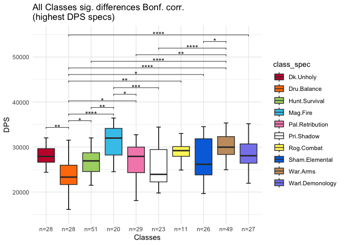<!-- -->

## Comparing DPS in relation to Guild Membership

``` r
# reorder guild factor levels
df_dps$guild <- factor(df_dps$guild, levels=c("No Guild", "Below Average", "GG", "Illusion", 
                                                      "Prime", "Spice", "Wheelchair Raiders"))
```

``` r
# summary statistics
sum_stats_guild <- df_dps %>%
  group_by(guild) %>%
  get_summary_stats(DPS, type="mean_sd")
sum_stats_guild
```

    ## # A tibble: 7 × 5
    ##   guild              variable     n   mean    sd
    ##   <fct>              <fct>    <dbl>  <dbl> <dbl>
    ## 1 No Guild           DPS        112 27453. 4222.
    ## 2 Below Average      DPS         17 25626. 2980.
    ## 3 GG                 DPS         30 26667. 3209.
    ## 4 Illusion           DPS         67 29107. 4006.
    ## 5 Prime              DPS         39 26267. 2882.
    ## 6 Spice              DPS         46 26634. 4256.
    ## 7 Wheelchair Raiders DPS         64 27673. 4663.

``` r
df_dps %>%
  group_by(guild) %>%
  get_summary_stats(itemlvl, type="mean_sd")
```

    ## # A tibble: 7 × 5
    ##   guild              variable     n  mean    sd
    ##   <fct>              <fct>    <dbl> <dbl> <dbl>
    ## 1 No Guild           itemlvl    112  385.  3.81
    ## 2 Below Average      itemlvl     17  382.  3.81
    ## 3 GG                 itemlvl     30  384.  4.67
    ## 4 Illusion           itemlvl     67  386.  5.05
    ## 5 Prime              itemlvl     39  382.  4.64
    ## 6 Spice              itemlvl     46  384.  5.29
    ## 7 Wheelchair Raiders itemlvl     64  386.  4.07

``` r
colPalette <- c("#994C00", "#E69F00", "#56B4E9", "#009E73", "#0072B2", "#D55E00", "#CC79A7")

g_names <- sum_stats_guild$guild
g_nval <- sum_stats_guild$n
                      
df_dps %>% 
  ggplot( aes(x=guild, y=DPS, fill=guild)) +
  stat_boxplot(geom="errorbar", width=0.2) +
  geom_boxplot() +
  scale_fill_manual(values=colPalette) +
  geom_jitter(color="black", size=0.4, alpha=0.4) +
  ggtitle("Comparing DPS based on guild membership \n(all DPS specs)") +
  xlab("Guilds") +
  scale_x_discrete(labels=unlist(lapply(g_nval, function(x) {paste0("n=",x)}))) +
  labs(fill="Guilds") +
  theme_classic()
```

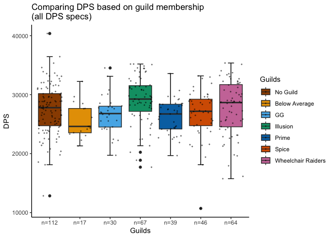<!-- -->

``` r
# linearity assumption (covariate ~ outcome for each factor level)
df_dps %>% ggscatter(x="itemlvl", y="DPS", color="guild", add="reg.line") +
  stat_regline_equation( aes(label=paste(..eq.label.., ..rr.label.., sep = "~~~~"), color=guild)
)
```

    ## Warning: The dot-dot notation (`..eq.label..`) was deprecated in ggplot2 3.4.0.
    ## ℹ Please use `after_stat(eq.label)` instead.
    ## ℹ The deprecated feature was likely used in the ggpubr package.
    ##   Please report the issue at <https://github.com/kassambara/ggpubr/issues>.
    ## This warning is displayed once every 8 hours.
    ## Call `lifecycle::last_lifecycle_warnings()` to see where this warning was
    ## generated.

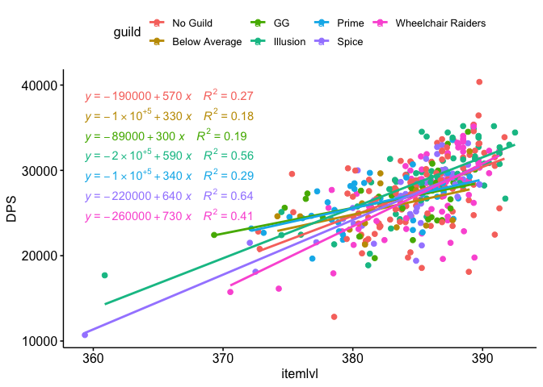<!-- -->

``` r
# homogeneity of regression slopes 
# sig. interaction term -> switch to multiple regression model
anova(aov(formula=DPS ~ guild * itemlvl, data=df_dps))
```

    ## Analysis of Variance Table
    ## 
    ## Response: DPS
    ##                Df     Sum Sq    Mean Sq  F value    Pr(>F)    
    ## guild           6  346789549   57798258   5.7876 9.031e-06 ***
    ## itemlvl         1 2235882616 2235882616 223.8871 < 2.2e-16 ***
    ## guild:itemlvl   6  137411085   22901847   2.2932   0.03472 *  
    ## Residuals     361 3605181465    9986652                       
    ## ---
    ## Signif. codes:  0 '***' 0.001 '**' 0.01 '*' 0.05 '.' 0.1 ' ' 1

``` r
# sig improvement of model fit when allowing for interaction (ancova vs mult reg)
ancova   <- lm(DPS ~ guild + itemlvl, data=df_dps)
mult_reg <- lm(DPS ~ guild * itemlvl, data=df_dps)
anova(ancova, mult_reg) 
```

    ## Analysis of Variance Table
    ## 
    ## Model 1: DPS ~ guild + itemlvl
    ## Model 2: DPS ~ guild * itemlvl
    ##   Res.Df        RSS Df Sum of Sq      F  Pr(>F)  
    ## 1    367 3742592549                              
    ## 2    361 3605181465  6 137411085 2.2932 0.03472 *
    ## ---
    ## Signif. codes:  0 '***' 0.001 '**' 0.01 '*' 0.05 '.' 0.1 ' ' 1

``` r
# results omnibus test
anova(mult_reg)
```

    ## Analysis of Variance Table
    ## 
    ## Response: DPS
    ##                Df     Sum Sq    Mean Sq  F value    Pr(>F)    
    ## guild           6  346789549   57798258   5.7876 9.031e-06 ***
    ## itemlvl         1 2235882616 2235882616 223.8871 < 2.2e-16 ***
    ## guild:itemlvl   6  137411085   22901847   2.2932   0.03472 *  
    ## Residuals     361 3605181465    9986652                       
    ## ---
    ## Signif. codes:  0 '***' 0.001 '**' 0.01 '*' 0.05 '.' 0.1 ' ' 1

``` r
# create residual vs. fitted plot
suppressPackageStartupMessages(library(lmtest))

plot(fitted(mult_reg), resid(mult_reg), xlab="Fitted Values", ylab="Residuals")
abline(0,0)
```

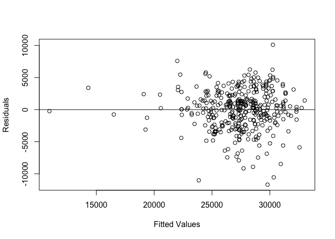<!-- -->

``` r
# perform Breusch-Pagan test to check for Homoscedasticity
# tests null of residuals are distributed with equal variances
bptest(mult_reg)
```

    ## 
    ##  studentized Breusch-Pagan test
    ## 
    ## data:  mult_reg
    ## BP = 16.407, df = 13, p-value = 0.2279

``` r
# QQ Plots 
ggqqplot(df_dps, "DPS", facet.by="guild", size=0.3)
```

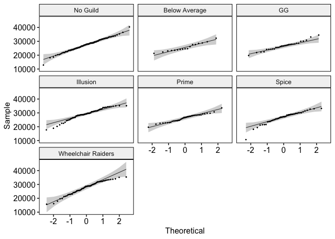<!-- -->

``` r
# post hoc comparisons
post_hoc_guild <- df_dps %>% pairwise_t_test(DPS ~ guild, p.adjust.method = "bonferroni")
post_hoc_guild
```

    ## # A tibble: 21 × 9
    ##    .y.   group1        group2           n1    n2        p p.sig…¹  p.adj p.adj…²
    ##  * <chr> <chr>         <chr>         <int> <int>    <dbl> <chr>    <dbl> <chr>  
    ##  1 DPS   No Guild      Below Average   112    17 0.0825   ns      1      ns     
    ##  2 DPS   No Guild      GG              112    30 0.343    ns      1      ns     
    ##  3 DPS   Below Average GG               17    30 0.396    ns      1      ns     
    ##  4 DPS   No Guild      Illusion        112    67 0.00826  **      0.173  ns     
    ##  5 DPS   Below Average Illusion         17    67 0.0016   **      0.0336 *      
    ##  6 DPS   GG            Illusion         30    67 0.00615  **      0.129  ns     
    ##  7 DPS   No Guild      Prime           112    39 0.114    ns      1      ns     
    ##  8 DPS   Below Average Prime            17    39 0.585    ns      1      ns     
    ##  9 DPS   GG            Prime            30    39 0.683    ns      1      ns     
    ## 10 DPS   Illusion      Prime            67    39 0.000526 ***     0.011  *      
    ## # … with 11 more rows, and abbreviated variable names ¹​p.signif, ²​p.adj.signif

``` r
# boxplots with sig. differences

# list of vectors containing all sig. comparisons
group1_guild          <- post_hoc_guild$group1[post_hoc_guild$p.adj<.05]
group2_guild          <- post_hoc_guild$group2[post_hoc_guild$p.adj<.05]
comparison_list_guild <- unname(mapply(function(x,y) {c(x,y)}, x=group1_guild, y=group2_guild, SIMPLIFY = FALSE))

pval_guild        <- post_hoc_guild$p.adj[post_hoc_guild$p.adj<.05]
pval_star_guild   <- post_hoc_guild$p.adj.signif[post_hoc_guild$p.adj<.05]

df_dps %>%
  ggplot( aes(x=guild, y=DPS, fill=guild)) +
  stat_boxplot(geom="errorbar", width=0.2) +
  geom_boxplot(outlier.alpha=0) +
  scale_fill_manual(values=colPalette) +
  geom_signif(
    comparisons=comparison_list_guild,
    annotations=pval_star_guild,
    vjust=0.7,
    y_position=c(35000, 36500, 38000),
    size=0.6,
    tip_length=0.02
  ) +
  ggtitle("Comparing DPS based on guild membership \n(all DPS specs)") +
  xlab("Guilds") +
  scale_x_discrete(labels=unlist(lapply(g_nval, function(x) {paste0("n=",x)}))) +
  labs(fill="Guilds") +
  theme_classic()
```

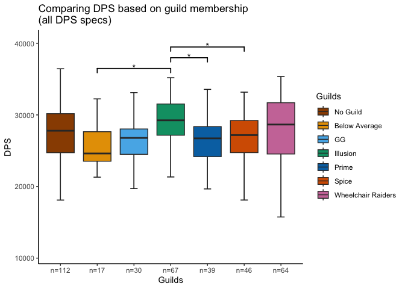<!-- -->

``` r
# plotting itemlvl differences for comparisons

df_dps %>%
  ggplot( aes(x=guild, y=itemlvl, fill=guild)) +
  stat_boxplot(geom="errorbar", width=0.2) +
  geom_boxplot() +
  scale_fill_manual(values=colPalette) +
  geom_jitter(color="black", size=0.4, alpha=0.4) +
  ggtitle("Comparing average item level based on guild membership \n(all DPS specs)") +
  xlab("Guilds") +
  ylab("Avg. Item lvl") +
  scale_x_discrete(labels=unlist(lapply(g_nval, function(x) {paste0("n=",x)}))) +
  labs(fill="Guilds") +
  theme_classic()
```

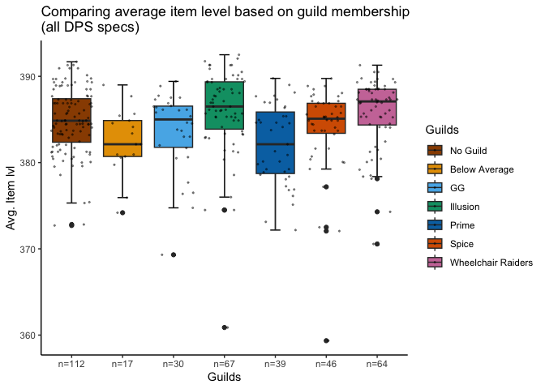<!-- -->

``` r
# post hoc comparisons
post_hoc_guild_ilvl <- df_dps %>% pairwise_t_test(itemlvl ~ guild, p.adjust.method = "bonferroni")
post_hoc_guild_ilvl
```

    ## # A tibble: 21 × 9
    ##    .y.     group1        group2         n1    n2       p p.sig…¹   p.adj p.adj…²
    ##  * <chr>   <chr>         <chr>       <int> <int>   <dbl> <chr>     <dbl> <chr>  
    ##  1 itemlvl No Guild      Below Aver…   112    17 4.15e-2 *       0.871   ns     
    ##  2 itemlvl No Guild      GG            112    30 1.58e-1 ns      1       ns     
    ##  3 itemlvl Below Average GG             17    30 4.27e-1 ns      1       ns     
    ##  4 itemlvl No Guild      Illusion      112    67 1.23e-1 ns      1       ns     
    ##  5 itemlvl Below Average Illusion       17    67 4.77e-3 **      0.1     ns     
    ##  6 itemlvl GG            Illusion       30    67 1.64e-2 *       0.345   ns     
    ##  7 itemlvl No Guild      Prime         112    39 9.85e-4 ***     0.0207  *      
    ##  8 itemlvl Below Average Prime          17    39 7.7 e-1 ns      1       ns     
    ##  9 itemlvl GG            Prime          30    39 1.8 e-1 ns      1       ns     
    ## 10 itemlvl Illusion      Prime          67    39 2.71e-5 ****    0.00057 ***    
    ## # … with 11 more rows, and abbreviated variable names ¹​p.signif, ²​p.adj.signif

``` r
# boxplots with sig. differences of itemlvl

# create list of vectors containing all sig. comparisons
group1_guild_ilvl          <- post_hoc_guild_ilvl$group1[post_hoc_guild_ilvl$p.adj<.05]
group2_guild_ilvl          <- post_hoc_guild_ilvl$group2[post_hoc_guild_ilvl$p.adj<.05]
comparison_list_guild_ilvl <- unname(mapply(function(x,y) {c(x,y)}, x=group1_guild_ilvl, y=group2_guild_ilvl, SIMPLIFY = FALSE))

pval_star_guild_ilvl   <- post_hoc_guild_ilvl$p.adj.signif[post_hoc_guild_ilvl$p.adj<.05]

df_dps %>%
  ggplot( aes(x=guild, y=itemlvl, fill=guild)) +
  ylim(360,400) +
  stat_boxplot(geom="errorbar", width=0.2) +
  scale_fill_manual(values=colPalette) +
  geom_boxplot(outlier.alpha=0) +
  geom_signif(
    comparisons=comparison_list_guild_ilvl,
    annotations=pval_star_guild_ilvl,
    vjust=0.7,
    y_position=c(394,396,398),
    size=0.6,
    tip_length=0.02
    ) +
  ggtitle("Comparing average item level based on guild membership (Bonferroni corrected) \n(all DPS specs)") +
  xlab("Guilds") +
  ylab("Avg. Item lvl") +
  labs(fill="Guilds") +
  scale_x_discrete(labels=unlist(lapply(g_nval, function(x) {paste0("n=",x)}))) +
  theme_classic()
```

    ## Warning: Removed 1 rows containing non-finite values (`stat_boxplot()`).
    ## Removed 1 rows containing non-finite values (`stat_boxplot()`).

    ## Warning: Removed 1 rows containing non-finite values (`stat_signif()`).

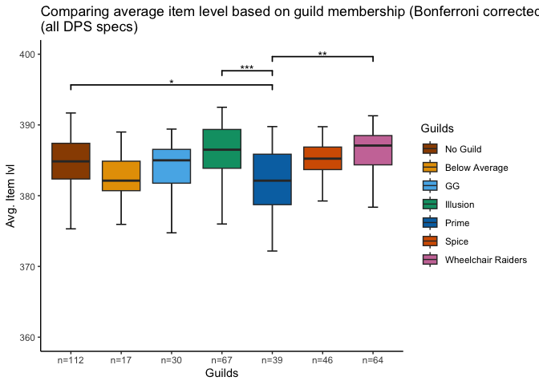<!-- -->

``` r
correl <- cor.test(df_dps$DPS,df_dps$itemlvl)
correl
```

    ## 
    ##  Pearson's product-moment correlation
    ## 
    ## data:  df_dps$DPS and df_dps$itemlvl
    ## t = 15.589, df = 373, p-value < 2.2e-16
    ## alternative hypothesis: true correlation is not equal to 0
    ## 95 percent confidence interval:
    ##  0.5626058 0.6857436
    ## sample estimates:
    ##       cor 
    ## 0.6280909

``` r
# scatterplot: relationship between item level and guild membership to DPS

df_dps %>% 
  ggplot() +
  geom_point( aes(x=itemlvl, y=DPS, fill=guild, color=guild), size=1) +
  scale_color_manual(values=colPalette) +
  labs(color="Guilds") +
  geom_smooth( aes(x=itemlvl, y=DPS), method="lm", se=FALSE, color="black", size=0.5) +
  annotate(geom="text", label=paste0("DPS ~ Item Level \n(r=", round(correl$estimate, 2), ")***"), 
           x=366, y=20000, size=3, color="black") +
  ggtitle("Relationship of guild membership and item level to DPS") +
  xlab("Average Item Level") +
  guides(fill=FALSE) +
  theme_classic()
```

    ## Warning: Using `size` aesthetic for lines was deprecated in ggplot2 3.4.0.
    ## ℹ Please use `linewidth` instead.
    ## This warning is displayed once every 8 hours.
    ## Call `lifecycle::last_lifecycle_warnings()` to see where this warning was
    ## generated.

    ## Warning: The `<scale>` argument of `guides()` cannot be `FALSE`. Use "none" instead as
    ## of ggplot2 3.3.4.
    ## This warning is displayed once every 8 hours.
    ## Call `lifecycle::last_lifecycle_warnings()` to see where this warning was
    ## generated.

    ## `geom_smooth()` using formula = 'y ~ x'

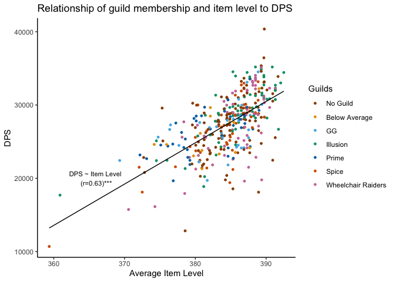<!-- -->
