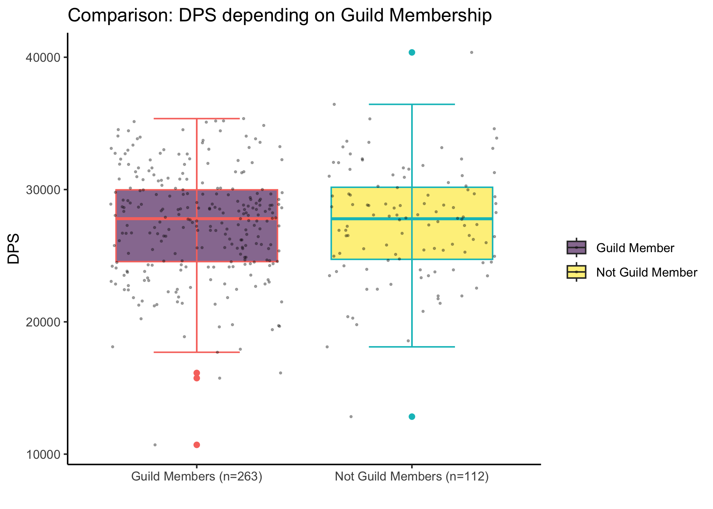

ApolloPy Descriptive Statistics
================

## DPS Comparisons for Baleroc 25 Heroic Difficulty

``` r
# clear workspace
rm(list = ls())

# load data relating to Baleroc 25 hc for each class and spec
files <- list.files("./data_csv/", pattern = "Baleroc_25hc*")

# load data
data          <- lapply(paste0("./data_csv/", files), read.csv)
data_dps      <- lapply(data, function(x) {x$dps})
data_ilvl     <- lapply(data, function(x) {x$avg_item_lvl})
data_fightlen <- lapply(data, function(x) {x$length})

# formatting class / spec
class_spec <- lapply(files, function(x) {strsplit(x, "_")[[1]][3:4]})
class      <- lapply(class_spec, function(x) {x[1]})
spec       <- lapply(class_spec, function(x) {sub(" ", "_", x[2])})
```

``` r
# append NAs to each vector if shorter than max_len
max_len <- max(unlist(lapply(data_dps, function(x) {length(x)})))

data_dps_na <- list()
for (i in seq_along(data_dps)) {
 if (length(data_dps[[i]])<max_len) {
   data_dps_na[[i]] <- c(data_dps[[i]], rep(NA_character_, max_len-length(data_dps[[i]])))
 } else {
   data_dps_na[[i]] <- data_dps[[i]]
 }
}

data_df <- data.frame(x = rep(NA_character_, max_len))

# append columns
for (i in seq_along(data_dps_na)) {
 data_df[, i] <- data_dps_na[[i]]
}
```

``` r
# rename columns
class_spec_2 <- list()
for (i in seq_along(class)) {
  class_spec_2[i] <- paste0(class[[i]], ".", spec[[i]])
}
colnames(data_df) <- class_spec_2
```

``` r
suppressPackageStartupMessages(library(tidyverse))

data_df <- plyr::colwise(as.numeric)(data_df)
```

``` r
# convert wide to long format (ignore NAs)
data_df_long <- data_df %>%
  gather(key = "class_spec", value = "DPS") %>%
  na.omit() %>%
  mutate()
```

``` r
data_df_long$class <- lapply(data_df_long$class_spec, function(x) {strsplit(x, ".", fixed = TRUE)[[1]][1]})
data_df_long$class <- lapply(data_df_long$class, toupper)

data_df_long$spec <- lapply(data_df_long$class_spec, function(x) {strsplit(x, ".", fixed = TRUE)[[1]][2]})
data_df_long$spec <- lapply(data_df_long$spec, toupper)

# trim leading white space
data_df_long$class <- as.character(trimws(data_df_long$class))
data_df_long$spec <- as.character(trimws(data_df_long$spec))
```

### Plotting DPS for each class

All talent specializations are included.

``` r
# Boxplot
# Order: DK, Druid, Hunter, Mage, Paladin, Priest, Rogue, Shaman, Warrior, Warlock
class_colors <- c("#C41E3A", "#FF7C0A", "#AAD372", "#3FC7EB", "#F48CBA", "#FFFFFF", "#FFF468", "#0070DD", "#C69B6D", "#8788EE")

data_df_long %>%
  ggplot(aes(x=class, y=DPS, fill = class, color = class)) +
  geom_boxplot() + 
  geom_jitter(color="black", size=0.4, alpha=0.7) +
  scale_fill_manual(values=class_colors) +
  ggtitle("DPS Comparison: All Classes / All Specs") +
  xlab("Classes") +
  labs(fill="Classes") +
  guides(color=FALSE) +
  theme_classic()
```

    ## Warning: The `<scale>` argument of `guides()` cannot be `FALSE`. Use "none" instead as
    ## of ggplot2 3.3.4.
    ## This warning is displayed once every 8 hours.
    ## Call `lifecycle::last_lifecycle_warnings()` to see where this warning was
    ## generated.

<!-- -->

``` r
# Violin Plot
data_df_long %>%
  ggplot(aes(x=class, y=DPS, fill = class, color = class)) +
  geom_violin() +
  scale_fill_manual(values=class_colors) +
  ggtitle("DPS Comparison: All Classes / All Specs") +
  xlab("Classes") +
  labs(fill="Classes") +
  guides(color=FALSE) +
  theme_classic()
```

<!-- -->

### Descriptive Statistics displaying DPS characteristics for each class and specilazitaion

    ## Warning in qt((0.5 + p/2), (Nbrval - 1)): NaNs produced

|              | Dk.Blood    | Dk.Frost | Dk.Unholy | Dru.Balance | Dru.Feral_Combat |
|:-------------|:------------|:---------|:----------|:------------|:-----------------|
| nbr.val      | 18.00       | 1        | 28.0      | 28.00       | 18.00            |
| nbr.null     | 0.00        | 0        | 0.0       | 0.00        | 0.00             |
| nbr.na       | 33.00       | 50       | 23.0      | 23.00       | 33.00            |
| min          | 1375.34     | 22866    | 18108.8   | 12835.06    | 15745.17         |
| max          | 16693.88    | 22866    | 32033.6   | 33568.00    | 26688.96         |
| range        | 15318.54    | 0        | 13924.9   | 20732.95    | 10943.78         |
| sum          | 221378.56   | 22866    | 776789.9  | 664076.37   | 406496.96        |
| median       | 13148.99    | 22866    | 27918.9   | 23221.53    | 22644.88         |
| mean         | 12298.81    | 22866    | 27742.5   | 23717.01    | 22583.16         |
| SE.mean      | 820.35      | NA       | 527.2     | 867.69      | 727.22           |
| CI.mean.0.95 | 1730.79     | NaN      | 1081.8    | 1780.35     | 1534.30          |
| var          | 12113530.15 | NA       | 7782814.6 | 21080728.69 | 9519258.72       |
| std.dev      | 3480.45     | NA       | 2789.8    | 4591.38     | 3085.33          |
| coef.var     | 0.28        | NA       | 0.1       | 0.19        | 0.14             |

    ## Warning in qt((0.5 + p/2), (Nbrval - 1)): NaNs produced

    ## Warning in qt((0.5 + p/2), (Nbrval - 1)): NaNs produced

|              | Dru.Restoration | Hunt.Beast_Mastery | Hunt.Marksmanship | Hunt.Survival | Mag.Arcane |
|:-------------|:----------------|:-------------------|:------------------|:--------------|:-----------|
| nbr.val      | 28              | 4.0                | 1                 | 51.00         | 1          |
| nbr.null     | 21              | 0.0                | 0                 | 0.00          | 0          |
| nbr.na       | 23              | 47.0               | 50                | 0.00          | 50         |
| min          | 0               | 21957.4            | 25160             | 21511.43      | 10702      |
| max          | 206             | 28043.8            | 25160             | 32031.64      | 10702      |
| range        | 206             | 6086.4             | 0                 | 10520.22      | 0          |
| sum          | 851             | 102895.6           | 25160             | 1369179.90    | 10702      |
| median       | 0               | 26447.2            | 25160             | 26921.91      | 10702      |
| mean         | 30              | 25723.9            | 25160             | 26846.66      | 10702      |
| SE.mean      | 12              | 1314.9             | NA                | 336.86        | NA         |
| CI.mean.0.95 | 24              | 4184.5             | NaN               | 676.61        | NaN        |
| var          | 3716            | 6915467.3          | NA                | 5787354.05    | NA         |
| std.dev      | 61              | 2629.7             | NA                | 2405.69       | NA         |
| coef.var     | 2               | 0.1                | NA                | 0.09          | NA         |

    ## Warning in qt((0.5 + p/2), (Nbrval - 1)): NaNs produced

|              | Mag.Fire    | Mag.Frost   | Pal.Holy | Pal.Protection | Pal.Retribution |
|:-------------|:------------|:------------|:---------|:---------------|:----------------|
| nbr.val      | 20.00       | 2.000       | 38.00    | 1              | 29.00           |
| nbr.null     | 0.00        | 0.000       | 0.00     | 0              | 0.00            |
| nbr.na       | 31.00       | 49.000      | 13.00    | 50             | 22.00           |
| min          | 18876.53    | 28240.969   | 17.86    | 11944          | 18114.77        |
| max          | 36440.81    | 30969.644   | 251.49   | 11944          | 32737.34        |
| range        | 17564.28    | 2728.675    | 233.63   | 0              | 14622.57        |
| sum          | 615398.90   | 59210.613   | 3952.02  | 11944          | 788121.67       |
| median       | 31986.88    | 29605.307   | 90.54    | 11944          | 27927.51        |
| mean         | 30769.95    | 29605.307   | 104.00   | 11944          | 27176.61        |
| SE.mean      | 1022.42     | 1364.337    | 9.00     | NA             | 712.11          |
| CI.mean.0.95 | 2139.94     | 17335.550   | 18.23    | NaN            | 1458.69         |
| var          | 20906657.94 | 3722833.082 | 3077.03  | NA             | 14705851.05     |
| std.dev      | 4572.38     | 1929.464    | 55.47    | NA             | 3834.82         |
| coef.var     | 0.15        | 0.065       | 0.53     | NA             | 0.14            |

|              | Pri.Discipline | Pri.Holy | Pri.Shadow  | Rog.Assassination | Rog.Combat  |
|:-------------|:---------------|:---------|:------------|:------------------|:------------|
| nbr.val      | 17.00          | 8.00     | 23.00       | 29.0              | 11.000      |
| nbr.null     | 0.00           | 1.00     | 0.00        | 0.0               | 0.000       |
| nbr.na       | 34.00          | 43.00    | 28.00       | 22.0              | 40.000      |
| min          | 3374.99        | 0.00     | 19786.76    | 17701.2           | 24880.797   |
| max          | 8297.89        | 505.12   | 34437.24    | 32308.8           | 33013.351   |
| range        | 4922.90        | 505.12   | 14650.48    | 14607.6           | 8132.554    |
| sum          | 96320.18       | 2241.76  | 588340.40   | 817511.6          | 319151.907  |
| median       | 5470.58        | 308.38   | 23929.17    | 28605.4           | 29203.500   |
| mean         | 5665.89        | 280.22   | 25580.02    | 28190.1           | 29013.810   |
| SE.mean      | 309.12         | 53.90    | 940.17      | 528.9             | 735.975     |
| CI.mean.0.95 | 655.31         | 127.45   | 1949.80     | 1083.3            | 1639.853    |
| var          | 1624479.23     | 23240.04 | 20330249.72 | 8110959.9         | 5958243.658 |
| std.dev      | 1274.55        | 152.45   | 4508.91     | 2848.0            | 2440.951    |
| coef.var     | 0.22           | 0.54     | 0.18        | 0.1               | 0.084       |

|              | Rog.Subtlety | Sham.Elemental | Sham.Enhancement | Sham.Restoration | War.Arms    |
|:-------------|:-------------|:---------------|:-----------------|:-----------------|:------------|
| nbr.val      | 4.00         | 26.00          | 5.00             | 3.00             | 49.000      |
| nbr.null     | 0.00         | 0.00           | 0.00             | 0.00             | 0.000       |
| nbr.na       | 47.00        | 25.00          | 46.00            | 48.00            | 2.000       |
| min          | 24070.34     | 19663.02       | 23186.06         | 321.99           | 24954.371   |
| max          | 31819.84     | 34522.01       | 30502.94         | 579.53           | 40365.807   |
| range        | 7749.49      | 14858.99       | 7316.88          | 257.53           | 15411.436   |
| sum          | 110525.27    | 709887.26      | 133333.98        | 1300.15          | 1488741.595 |
| median       | 27317.54     | 26165.99       | 27250.24         | 398.63           | 29973.519   |
| mean         | 27631.32     | 27303.36       | 26666.80         | 433.38           | 30382.482   |
| SE.mean      | 1780.92      | 853.58         | 1268.68          | 76.35            | 426.319     |
| CI.mean.0.95 | 5667.69      | 1757.99        | 3522.42          | 328.49           | 857.172     |
| var          | 12686731.69  | 18943702.33    | 8047739.71       | 17486.63         | 8905652.090 |
| std.dev      | 3561.84      | 4352.44        | 2836.85          | 132.24           | 2984.234    |
| coef.var     | 0.13         | 0.16           | 0.11             | 0.31             | 0.098       |

|              | War.Arms    | War.Fury   | Warl.Affliction | Warl.Demonology | Warl.Destruction |
|:-------------|:------------|:-----------|:----------------|:----------------|:-----------------|
| nbr.val      | 49.000      | 2.000      | 13.00           | 27.00           | 3.00             |
| nbr.null     | 0.000       | 0.000      | 0.00            | 0.00            | 0.00             |
| nbr.na       | 2.000       | 49.000     | 38.00           | 24.00           | 48.00            |
| min          | 24954.371   | 27010.949  | 20793.39        | 21957.98        | 24394.20         |
| max          | 40365.807   | 28374.489  | 33834.97        | 35182.79        | 34037.37         |
| range        | 15411.436   | 1363.540   | 13041.58        | 13224.81        | 9643.17          |
| sum          | 1488741.595 | 55385.439  | 359945.54       | 770162.86       | 87295.64         |
| median       | 29973.519   | 27692.719  | 26230.06        | 28073.34        | 28864.07         |
| mean         | 30382.482   | 27692.719  | 27688.12        | 28524.55        | 29098.55         |
| SE.mean      | 426.319     | 681.770    | 1176.70         | 671.31          | 2786.21          |
| CI.mean.0.95 | 857.172     | 8662.711   | 2563.82         | 1379.89         | 11988.09         |
| var          | 8905652.090 | 929621.075 | 18000210.94     | 12167611.59     | 23288902.09      |
| std.dev      | 2984.234    | 964.169    | 4242.67         | 3488.21         | 4825.86          |
| coef.var     | 0.098       | 0.035      | 0.15            | 0.12            | 0.17             |

``` r
# identifying highest DPS spec for each class
classes_unique <- unique(unlist(class))
max_dps_list <- list()
max_dps_ind <- list()

for (c in classes_unique) {
  max_dps_spec <- which.max(plyr::colwise(max, na.rm=TRUE)(data_df[, grep(pattern=paste0(c, ".*"), names(data_df))]))
  max_dps_ind <- append(max_dps_ind, max_dps_spec)
  
  max_dps_val <- plyr::colwise(max, na.rm=TRUE)(data_df[, grep(pattern=paste0(c, ".*"), names(data_df))])
  max_dps_list <- append(max_dps_list, max_dps_val)
}

max_dps_spec_names <- names(max_dps_ind)

# rename non-unique specs 
data_df_long$spec[data_df_long$spec=="HOLY" & data_df_long$class=="PRI"] <- rep(x="HOLY_PRI", times=length(data_df_long$spec[data_df_long$spec=="HOLY" & data_df_long$class=="PRI"]))
data_df_long$spec[data_df_long$spec=="HOLY" & data_df_long$class=="PAL"] <- rep(x="HOLY_PAL", times=length(data_df_long$spec[data_df_long$spec=="HOLY" & data_df_long$class=="PAL"]))

data_df_long$spec[data_df_long$spec=="FROST" & data_df_long$class=="DK"] <- rep(x="FROST_DK", times=length(data_df_long$spec[data_df_long$spec=="FROST" & data_df_long$class=="DK"]))
data_df_long$spec[data_df_long$spec=="FROST" & data_df_long$class=="MAG"] <- rep(x="FROST_MAG", times=length(data_df_long$spec[data_df_long$spec=="FROST" & data_df_long$class=="MAG"]))

data_df_long$spec[data_df_long$spec=="RESTORATION" & data_df_long$class=="DRU"] <- rep(x="RESTORATION_DRU", times=length(data_df_long$spec[data_df_long$spec=="RESTORATION" & data_df_long$class=="DRU"]))
data_df_long$spec[data_df_long$spec=="RESTORATION" & data_df_long$class=="SHAM"] <- rep(x="RESTORATION_SHAM", times=length(data_df_long$spec[data_df_long$spec=="RESTORATION" & data_df_long$class=="SHAM"]))
```

``` r
# plot max DPS for each Class - Specialization Combination

class_spec_count   <- list()
class_spec_list    <- list()
for (i in unique(data_df_long$class)) {
  class_spec_list    <- append(class_spec_list, unique(data_df_long$spec[data_df_long$class==i]))
  class_spec_count   <- append(class_spec_count, length(unique(data_df_long$spec[data_df_long$class==i])))
}

class_spec_max_dps <- list()
for (i in class_spec_list) {class_spec_max_dps <- append(class_spec_max_dps, max(data_df_long$DPS[data_df_long$spec==i]))}

plot_df_max_dps <- data.frame(class_spec=unique(data_df_long$class_spec),
                              DPS=unlist(class_spec_max_dps),
                              class=rep(unique(data_df_long$class),unlist(class_spec_count)),
                              spec=unique(data_df_long$spec))

#factor classes + specs to keep order
plot_df_max_dps$class <- factor(plot_df_max_dps$class, levels=unique(data_df_long$class))
plot_df_max_dps$spec  <- factor(plot_df_max_dps$spec, levels=class_spec_list)

plot_df_max_dps %>% 
  ggplot( aes(x=spec, y=DPS, fill=class, color=spec)) +
  geom_bar(color="black", stat="identity", position="dodge") +
  scale_fill_manual(values=class_colors) +
  xlab("Talent Specialization") +
  labs(fill="Class") +
  ggtitle("Highest DPS values per Talent Specialization") +
  theme_linedraw() +
  theme(axis.text.x=element_text(angle=90, hjust=1, vjust=0.5))
```

<!-- -->

### Comparing DPS values for each class’ highest DPS specialization

``` r
# max DPS specs
spec_number_cases <- colSums(! is.na(data_df))
max_dps_spec_number_cases <- spec_number_cases[max_dps_spec_names]
data_df_max_dps <- data_df[max_dps_spec_names]

# convert to long format
data_df_max_dps_long <- data_df_max_dps %>%
  gather(key = "class_spec", value = "DPS") %>%
  na.omit() %>%
  mutate()

data_df_max_dps_long$class <- lapply(data_df_max_dps_long$class_spec, function(x) {strsplit(x, ".", fixed = TRUE)[[1]][1]})
data_df_max_dps_long$class <- lapply(data_df_max_dps_long$class, toupper)

data_df_max_dps_long$spec <- lapply(data_df_max_dps_long$class_spec, function(x) {strsplit(x, ".", fixed = TRUE)[[1]][2]})
data_df_max_dps_long$spec <- lapply(data_df_max_dps_long$spec, toupper)

# trim leading white space
data_df_max_dps_long$class <- as.character(trimws(data_df_max_dps_long$class))
data_df_max_dps_long$spec <- as.character(trimws(data_df_max_dps_long$spec))

# relabel axes
data_df_max_dps_long_classes <- unique(data_df_max_dps_long$class)
data_df_max_dps_long_specs <- unique(data_df_max_dps_long$spec)

new_x_axis <- lapply(max_dps_spec_number_cases, function(x) paste0("n=", x))
new_legend <- mapply(function(x, y) {paste(x, y, sep=": ")},
                     x=data_df_max_dps_long_classes,
                     y=data_df_max_dps_long_specs)
```

``` r
# barplots comparing best DPS specializations
new_x_axis <- unname(unlist(new_x_axis))
data_df_max_dps_long %>% 
  ggplot( aes(x=class, y=DPS, fill=class_spec, color=class_spec)) +
  geom_boxplot() +
  geom_jitter(color="black", size=0.4, alpha=0.7) +
  scale_fill_manual(values=class_colors) +
  ggtitle("DPS Comparison: Best DPS Specialisation of each Class") +
  xlab("Classes") +
  scale_x_discrete(labels=new_x_axis) +
  labs(fill="Class & Specialisation") +
  guides(color=FALSE) +
  theme_classic()
```

<!-- -->

``` r
# violinplots comparing best DPS specializations
data_df_max_dps_long %>% 
  ggplot( aes(x=class, y=DPS, fill=class_spec, color=class_spec)) +
  geom_violin() +
  scale_fill_manual(values=class_colors) +
  ggtitle("DPS Comparison: Best DPS Specialisation of each Class") +
  xlab("Classes") +
  scale_x_discrete(labels=new_x_axis) +
  labs(fill="Class & Specialisation") +
  guides(color=FALSE) +
  theme_classic()
```

<!-- -->

### Comparing DPS values based on Guild Membership Status (yes/no)

``` r
# create a full dataframe (including item-level, fight length, and guild membership)
data_guild <- lapply(data, function(x) {x$guild})

df_full_long          <- data_df_long[,1:2]
df_full_long$ilvl     <- unlist(data_ilvl)
df_full_long$fightlen <- unlist(data_fightlen)
df_full_long$guild    <- unlist(data_guild)

df_full_long$guild <- ifelse(df_full_long$guild=="", NA, df_full_long$guild)

# remove non-dps specs
non_dps <- c("Dk.Blood", "Dru.Restoration", "Pal.Holy", "Pal.Protection", "Pri.Discipline", "Pri.Holy", "Sham.Restoration")
df_dps_full_long <- df_full_long %>% dplyr::filter(!(class_spec %in% non_dps))
```

``` r
# compare damage of characters in a guild vs. characters in no guild
guild_dps <- df_dps_full_long$DPS[!is.na(df_dps_full_long$guild)]
noguild_dps <- df_dps_full_long$DPS[is.na(df_dps_full_long$guild)]

mean_dps_guild <- mean(guild_dps)
mean_dps_noguild <- mean(noguild_dps)

sd_dps_guild <- sd(guild_dps)
sd_dps_noguild <- sd(noguild_dps)

max_dps_guild <- max(guild_dps)
max_dps_noguild <- max(noguild_dps)

min_dps_guild <- min(guild_dps)
min_dps_noguild <- min(noguild_dps)

cat(paste0("Member of a guild:\nN = ",length(guild_dps), 
             "\nMean DPS = ", round(mean_dps_guild, 2),
             "\nSD = ", round(sd_dps_guild, 2),
             "\nRange = ", round(min_dps_guild, 2), " - ", round(max_dps_guild, 2)
             ))
```

    ## Member of a guild:
    ## N = 263
    ## Mean DPS = 27400.78
    ## SD = 4073.04
    ## Range = 10702.41 - 35362.39

``` r
cat(paste0("\n\nNon-Members:\nN = ",length(noguild_dps), 
             "\nMean DPS = ", round(mean_dps_noguild, 2),
             "\nSD = ", round(sd_dps_noguild, 2),
             "\nRange = ", round(min_dps_noguild, 2), " - ", round(max_dps_noguild, 2)
             ))
```

    ## 
    ## 
    ## Non-Members:
    ## N = 112
    ## Mean DPS = 27453.35
    ## SD = 4221.96
    ## Range = 12835.06 - 40365.81

``` r
# boxplot comparing average DPS for guild vs. not-guild members

guild_bxplt_df <- data.frame(
  guild=guild_dps,
  noguild=append(noguild_dps, rep(NA, length(guild_dps)-length(noguild_dps)))
)
guild_bxplt_df <- guild_bxplt_df %>% 
  gather(key="guild_factor", value="DPS") %>% 
  mutate()

guild_bxplt_df <- guild_bxplt_df %>% dplyr::filter(DPS>1000)

library(viridis)
```

    ## Loading required package: viridisLite

``` r
guild_bxplt_df %>% 
  ggplot( aes(x=guild_factor, y=DPS, fill=guild_factor, color=guild_factor)) +
  geom_boxplot() +
  stat_boxplot(geom="errorbar", width=0.4) +
  geom_jitter(color="black", size=0.4, alpha=0.3) +
  scale_fill_viridis(discrete = TRUE, alpha=0.6, labels=c("Guild Member", "Not Guild Member")) +
  ggtitle("Comparison: DPS depending on Guild Membership") +
  xlab("") +
  scale_x_discrete(labels=c(paste0("Guild Members (n=", length(guild_dps), ")"), 
                            paste0("Not Guild Members (n=", length(noguild_dps), ")"))) + 
  labs(fill="") +
  guides(color=FALSE) +
  theme_classic()
```

<!-- -->

``` r
# histogram with normal distribution laid over

guild_bxplt_df_guild <- data.frame(x=guild_bxplt_df$DPS[guild_bxplt_df=="guild"])
guild_bxplt_df_guild %>% 
  ggplot( aes(x=x)) +
  geom_histogram( aes(y=..density..),
    color="black", fill="#3399FF") +
  stat_function(fun = dnorm, args = list(mean=mean(guild_bxplt_df_guild$x), sd=sd(guild_bxplt_df_guild$x))) +
  ggtitle("Boxplot with Normal Curve: Guild Members") +
  ylab("") +
  xlab("DPS") +
  theme_classic() 
```

    ## Warning: The dot-dot notation (`..density..`) was deprecated in ggplot2 3.4.0.
    ## ℹ Please use `after_stat(density)` instead.
    ## This warning is displayed once every 8 hours.
    ## Call `lifecycle::last_lifecycle_warnings()` to see where this warning was
    ## generated.

    ## `stat_bin()` using `bins = 30`. Pick better value with `binwidth`.

<!-- -->

``` r
# histogram with normal distribution laid over

guild_bxplt_df_guild <- data.frame(x=guild_bxplt_df$DPS[guild_bxplt_df=="noguild"])
guild_bxplt_df_guild %>% 
  ggplot( aes(x=x)) +
  geom_histogram( aes(y=..density..),
    color="black", fill="#3399FF") +
  stat_function(fun = dnorm, args = list(mean=mean(guild_bxplt_df_guild$x), sd=sd(guild_bxplt_df_guild$x))) +
  ggtitle("Boxplot with Normal Curve: Not Guild Members") +
  ylab("") +
  xlab("DPS") +
  theme_classic() 
```

    ## `stat_bin()` using `bins = 30`. Pick better value with `binwidth`.

<!-- -->

``` r
# test equal variances (Levene's Test)
suppressPackageStartupMessages(library(car))
leveneTest(DPS ~ factor(guild_factor), guild_bxplt_df)
```

    ## Levene's Test for Homogeneity of Variance (center = median)
    ##        Df F value Pr(>F)
    ## group   1  0.0652 0.7985
    ##       373

### Hypothesis testing whether group means differ between Guild and Not-Guild Members

``` r
t.test(DPS ~ factor(guild_factor), guild_bxplt_df, var.equal=TRUE)
```

    ## 
    ##  Two Sample t-test
    ## 
    ## data:  DPS by factor(guild_factor)
    ## t = -0.11316, df = 373, p-value = 0.91
    ## alternative hypothesis: true difference in means between group guild and group noguild is not equal to 0
    ## 95 percent confidence interval:
    ##  -966.1969  861.0440
    ## sample estimates:
    ##   mean in group guild mean in group noguild 
    ##              27400.78              27453.35

Bayes Factor T-Test: quantifying likelihood for equal means
(i.e. classical t-test Null Hypothesis)

``` r
# Bayesian t-test: do both samples have similar means
suppressPackageStartupMessages(library(BayesFactor))
ttestBF(x=guild_bxplt_df$DPS[guild_bxplt_df$guild_factor=="guild"], y=guild_bxplt_df$DPS[guild_bxplt_df$guild_factor=="noguild"])
```

    ## Bayes factor analysis
    ## --------------
    ## [1] Alt., r=0.707 : 0.1250592 ±0.11%
    ## 
    ## Against denominator:
    ##   Null, mu1-mu2 = 0 
    ## ---
    ## Bayes factor type: BFindepSample, JZS

Bayes Factor = 0.1251 +/- 0.11. -\> Different means are very unlikely /
very likely that means are similar. -\> Guild and Not-Guild Members do
not differ in their average DPS.
