ApolloPy ANOVA
================

## DPS and Item-Level Analyses for Baleroc 25 Heroic Difficulty

### ANOVA / linear models

``` r
# clear workspace
rm(list = ls())

library(tidyverse)
```

``` r
library(ggpubr)
suppressPackageStartupMessages(library(rstatix))
```

``` r
# load data relating to Baleroc 25 hc for each class and spec
files <- list.files("./data_csv/", pattern = "Baleroc_25hc*")

# load data
data           <- lapply(paste0("./data_csv/", files), read.csv)
data_dps       <- lapply(data, function(x) {x$dps})
data_ilvl      <- lapply(data, function(x) {x$avg_item_lvl})
data_fightlen  <- lapply(data, function(x) {x$length})
data_guild     <- lapply(data, function(x) {x$guild})

# get class + spec from filename
class_spec   <- lapply(files, function(x) {strsplit(x, "_")[[1]][3:4]})
class        <- lapply(class_spec, function(x) {x[1]})
spec         <- lapply(class_spec, function(x) {sub(" ", "_", x[2])})
class_spec_2 <- mapply(function(x,y) paste0(x, ".", y), x=class, y=spec)

data_guild <- ifelse(unlist(data_guild)=="", "No Guild", unlist(data_guild))
```

``` r
# append NAs to each vector if shorter than max_len
max_len <- max(unlist(lapply(data_dps, function(x) {length(x)})))
data_dps_na <- list()
for (i in seq_along(data_dps)) {
 if (length(data_dps[[i]])<max_len) {
   data_dps_na[[i]] <- c(data_dps[[i]], rep(NA_character_, max_len-length(data_dps[[i]])))
 } else {
   data_dps_na[[i]] <- data_dps[[i]]
 }
}
df_wide <- data.frame(x = rep(NA_character_, max_len))

# append columns
for (i in seq_along(data_dps_na)) {
 df_wide[, i] <- data_dps_na[[i]]
}

colnames(df_wide) <- class_spec_2
df <- df_wide %>% 
  gather(key="class_spec", value="DPS") %>% 
  na.omit() %>% 
  mutate()
```

``` r
# formatting DF
df$DPS       <- as.numeric(df$DPS)
df$ID        <- 1:length(unlist(data_dps))
df$itemlvl   <- as.numeric(unlist(data_ilvl))
df$fight_len <- as.numeric(unlist(data_fightlen))
df$guild     <- data_guild

df$class_spec <- factor(df$class_spec)
df$ID         <- factor(df$ID)
df$guild      <- factor(df$guild)
```

## Comparing DPS depending on each class’ highest ranking DPS specialization

``` r
# remove non-dps specs
non_dps <- c("Dk.Blood", "Dru.Restoration", "Pal.Holy", "Pal.Protection", "Pri.Discipline", "Pri.Holy", "Sham.Restoration")
df_dps <- df %>% dplyr::filter(!(class_spec %in% non_dps))
```

| class_spec         | variable |   n |      mean |       sd |
|:-------------------|:---------|----:|----------:|---------:|
| Dk.Blood           | DPS      |  18 | 12298.809 | 3480.450 |
| Dk.Frost           | DPS      |   1 | 22865.839 |       NA |
| Dk.Unholy          | DPS      |  28 | 27742.495 | 2789.770 |
| Dru.Balance        | DPS      |  28 | 23717.013 | 4591.375 |
| Dru.Feral_Combat   | DPS      |  18 | 22583.165 | 3085.330 |
| Dru.Restoration    | DPS      |  28 |    30.405 |   60.959 |
| Hunt.Beast_Mastery | DPS      |   4 | 25723.891 | 2629.728 |
| Hunt.Marksmanship  | DPS      |   1 | 25159.779 |       NA |
| Hunt.Survival      | DPS      |  51 | 26846.665 | 2405.692 |
| Mag.Arcane         | DPS      |   1 | 10702.412 |       NA |
| Mag.Fire           | DPS      |  20 | 30769.945 | 4572.380 |
| Mag.Frost          | DPS      |   2 | 29605.307 | 1929.464 |
| Pal.Holy           | DPS      |  38 |   104.000 |   55.471 |
| Pal.Protection     | DPS      |   1 | 11943.706 |       NA |
| Pal.Retribution    | DPS      |  29 | 27176.609 | 3834.821 |
| Pri.Discipline     | DPS      |  17 |  5665.893 | 1274.551 |
| Pri.Holy           | DPS      |   8 |   280.220 |  152.447 |
| Pri.Shadow         | DPS      |  23 | 25580.017 | 4508.908 |
| Rog.Assassination  | DPS      |  29 | 28190.054 | 2847.975 |
| Rog.Combat         | DPS      |  11 | 29013.810 | 2440.951 |
| Rog.Subtlety       | DPS      |   4 | 27631.317 | 3561.844 |
| Sham.Elemental     | DPS      |  26 | 27303.356 | 4352.436 |
| Sham.Enhancement   | DPS      |   5 | 26666.795 | 2836.854 |
| Sham.Restoration   | DPS      |   3 |   433.385 |  132.237 |
| War.Arms           | DPS      |  49 | 30382.482 | 2984.234 |
| War.Fury           | DPS      |   2 | 27692.719 |  964.169 |
| Warl.Affliction    | DPS      |  13 | 27688.118 | 4242.666 |
| Warl.Demonology    | DPS      |  27 | 28524.550 | 3488.210 |
| Warl.Destruction   | DPS      |   3 | 29098.547 | 4825.858 |

## Comparing each classes’ highest DPS talent specialisation

``` r
# identifying highest DPS spec for each class
classes_unique <- unique(unlist(class))
max_dps_ind <- list()

for (c in classes_unique) {
  
  max_dps_spec <- df$class_spec[df$DPS==max(df$DPS[grep(pattern=paste0(c, ".*"), df$class_spec)])]
  max_dps_ind <- append(max_dps_ind, max_dps_spec)
  
}
```

``` r
df_max_dps <- df[df$class_spec %in% as.character(max_dps_ind),]
```

``` r
class_colors <- c("#C41E3A", "#FF7C0A", "#AAD372", "#3FC7EB", "#F48CBA", "#FFFFFF", "#FFF468", "#0070DD", "#C69B6D", "#8788EE")
new_x_axis <- c(paste0("n=", length(df_max_dps[df_max_dps$class_spec=="Dk.Unholy",]$class_spec)),
                paste0("n=", length(df_max_dps[df_max_dps$class_spec=="Dru.Balance",]$class_spec)),
                paste0("n=", length(df_max_dps[df_max_dps$class_spec=="Hunt.Survival",]$class_spec)),
                paste0("n=", length(df_max_dps[df_max_dps$class_spec=="Mag.Fire",]$class_spec)),
                paste0("n=", length(df_max_dps[df_max_dps$class_spec=="Pal.Retribution",]$class_spec)),
                paste0("n=", length(df_max_dps[df_max_dps$class_spec=="Pri.Shadow",]$class_spec)),
                paste0("n=", length(df_max_dps[df_max_dps$class_spec=="Rog.Combat",]$class_spec)),
                paste0("n=", length(df_max_dps[df_max_dps$class_spec=="Sham.Elemental",]$class_spec)),
                paste0("n=", length(df_max_dps[df_max_dps$class_spec=="War.Arms",]$class_spec)),
                paste0("n=", length(df_max_dps[df_max_dps$class_spec=="Warl.Demonology",]$class_spec))
)
                      
df_max_dps %>% 
  ggplot( aes(x=class_spec, y=DPS, fill=class_spec)) +
  stat_boxplot(geom="errorbar", width=0.2) +
  geom_boxplot() +
  geom_jitter(color="black", size=0.4, alpha=0.4) +
  scale_fill_manual(values=class_colors) +
  ggtitle("All Classes \n(highest DPS specs)") +
  xlab("Classes") +
  scale_x_discrete(labels=new_x_axis) +
  theme_minimal()
```

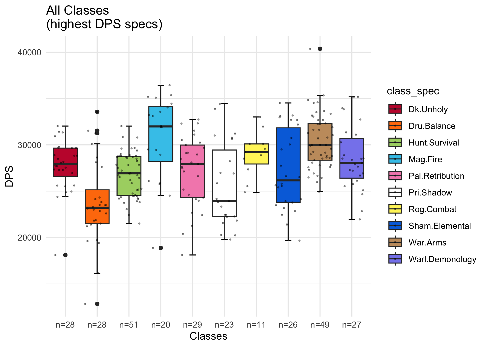<!-- -->

#### Checking Assumptions

``` r
# QQ Plots
ggqqplot(df_max_dps, "DPS", facet.by="class_spec", size=0.3, color="black")
```

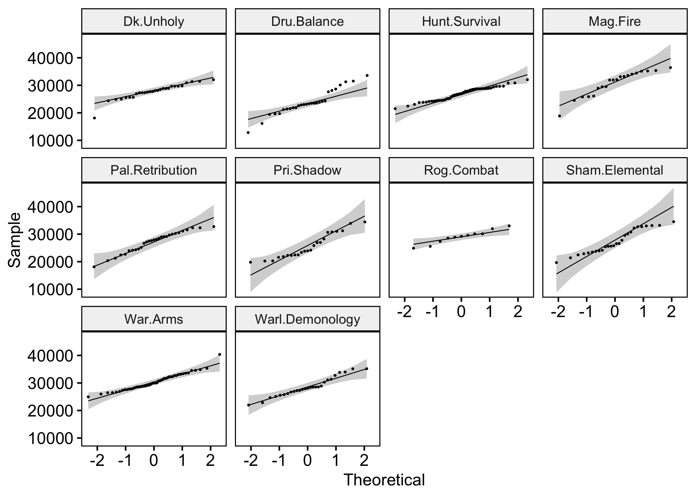<!-- -->

``` r
model <- lm(DPS ~ class_spec, data=df_max_dps)
shapiro.test(residuals(model))
```

    ## 
    ##  Shapiro-Wilk normality test
    ## 
    ## data:  residuals(model)
    ## W = 0.99446, p-value = 0.3699

``` r
plot(model, 1)
```

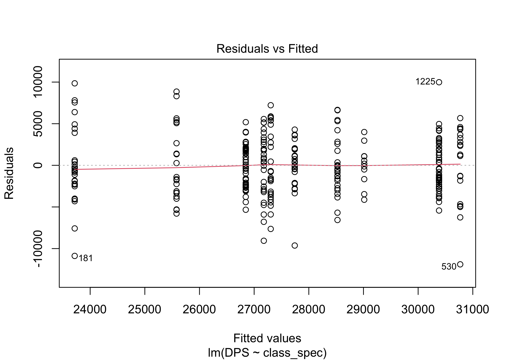<!-- -->

``` r
df_max_dps %>% levene_test(DPS ~ class_spec)
```

    ## # A tibble: 1 × 4
    ##     df1   df2 statistic       p
    ##   <int> <int>     <dbl>   <dbl>
    ## 1     9   282      2.51 0.00877

#### Omnibus Test (Null = DPS means are equal between all classes)

``` r
# ANOVA results
res.aov <- anova_test(data=df_max_dps, dv=DPS, between=class_spec)
get_anova_table(res.aov)
```

    ## ANOVA Table (type II tests)
    ## 
    ##       Effect DFn DFd      F        p p<.05   ges
    ## 1 class_spec   9 282 10.223 1.23e-13     * 0.246

``` r
# ANOVA using Welch's statistic with sig. Levene's Test
res.aov.welch <- welch_anova_test(data=df_max_dps, formula=DPS ~ class_spec)
get_anova_table(res.aov.welch)
```

    ## # A tibble: 1 × 7
    ##   .y.       n statistic   DFn   DFd             p method     
    ## * <chr> <int>     <dbl> <dbl> <dbl>         <dbl> <chr>      
    ## 1 DPS     292      8.99     9  90.7 0.00000000139 Welch ANOVA

#### Post Hoc Pairwise Comparisons (Bonferroni corrected): Differences in Mean DPS between Talent Specializations

| .y. | group1          | group2          |  n1 |  n2 |        p | p.signif |    p.adj | p.adj.signif |
|:----|:----------------|:----------------|----:|----:|---------:|:---------|---------:|:-------------|
| DPS | Dk.Unholy       | Dru.Balance     |  28 |  28 | 3.37e-05 | \*\*\*\* | 1.52e-03 | \*\*         |
| DPS | Dk.Unholy       | Hunt.Survival   |  28 |  51 | 2.87e-01 | ns       | 1.00e+00 | ns           |
| DPS | Dru.Balance     | Hunt.Survival   |  28 |  51 | 2.38e-04 | \*\*\*   | 1.07e-02 | \*           |
| DPS | Dk.Unholy       | Mag.Fire        |  28 |  20 | 4.11e-03 | \*\*     | 1.85e-01 | ns           |
| DPS | Dru.Balance     | Mag.Fire        |  28 |  20 | 0.00e+00 | \*\*\*\* | 0.00e+00 | \*\*\*\*     |
| DPS | Hunt.Survival   | Mag.Fire        |  51 |  20 | 4.22e-05 | \*\*\*\* | 1.90e-03 | \*\*         |
| DPS | Dk.Unholy       | Pal.Retribution |  28 |  29 | 5.51e-01 | ns       | 1.00e+00 | ns           |
| DPS | Dru.Balance     | Pal.Retribution |  28 |  29 | 3.08e-04 | \*\*\*   | 1.39e-02 | \*           |
| DPS | Hunt.Survival   | Pal.Retribution |  51 |  29 | 6.92e-01 | ns       | 1.00e+00 | ns           |
| DPS | Mag.Fire        | Pal.Retribution |  20 |  29 | 6.26e-04 | \*\*\*   | 2.82e-02 | \*           |
| DPS | Dk.Unholy       | Pri.Shadow      |  28 |  23 | 3.24e-02 | \*       | 1.00e+00 | ns           |
| DPS | Dru.Balance     | Pri.Shadow      |  28 |  23 | 6.50e-02 | ns       | 1.00e+00 | ns           |
| DPS | Hunt.Survival   | Pri.Shadow      |  51 |  23 | 1.59e-01 | ns       | 1.00e+00 | ns           |
| DPS | Mag.Fire        | Pri.Shadow      |  20 |  23 | 3.20e-06 | \*\*\*\* | 1.46e-04 | \*\*\*       |
| DPS | Pal.Retribution | Pri.Shadow      |  29 |  23 | 1.11e-01 | ns       | 1.00e+00 | ns           |
| DPS | Dk.Unholy       | Rog.Combat      |  28 |  11 | 3.18e-01 | ns       | 1.00e+00 | ns           |
| DPS | Dru.Balance     | Rog.Combat      |  28 |  11 | 4.14e-05 | \*\*\*\* | 1.86e-03 | \*\*         |
| DPS | Hunt.Survival   | Rog.Combat      |  51 |  11 | 6.92e-02 | ns       | 1.00e+00 | ns           |
| DPS | Mag.Fire        | Rog.Combat      |  20 |  11 | 1.92e-01 | ns       | 1.00e+00 | ns           |
| DPS | Pal.Retribution | Rog.Combat      |  29 |  11 | 1.48e-01 | ns       | 1.00e+00 | ns           |
| DPS | Pri.Shadow      | Rog.Combat      |  23 |  11 | 9.25e-03 | \*\*     | 4.16e-01 | ns           |
| DPS | Dk.Unholy       | Sham.Elemental  |  28 |  26 | 6.52e-01 | ns       | 1.00e+00 | ns           |
| DPS | Dru.Balance     | Sham.Elemental  |  28 |  26 | 2.75e-04 | \*\*\*   | 1.24e-02 | \*           |
| DPS | Hunt.Survival   | Sham.Elemental  |  51 |  26 | 5.96e-01 | ns       | 1.00e+00 | ns           |
| DPS | Mag.Fire        | Sham.Elemental  |  20 |  26 | 1.25e-03 | \*\*     | 5.60e-02 | ns           |
| DPS | Pal.Retribution | Sham.Elemental  |  29 |  26 | 8.96e-01 | ns       | 1.00e+00 | ns           |
| DPS | Pri.Shadow      | Sham.Elemental  |  23 |  26 | 9.32e-02 | ns       | 1.00e+00 | ns           |
| DPS | Rog.Combat      | Sham.Elemental  |  11 |  26 | 1.84e-01 | ns       | 1.00e+00 | ns           |
| DPS | Dk.Unholy       | War.Arms        |  28 |  49 | 2.01e-03 | \*\*     | 9.04e-02 | ns           |
| DPS | Dru.Balance     | War.Arms        |  28 |  49 | 0.00e+00 | \*\*\*\* | 0.00e+00 | \*\*\*\*     |
| DPS | Hunt.Survival   | War.Arms        |  51 |  49 | 1.30e-06 | \*\*\*\* | 5.87e-05 | \*\*\*\*     |
| DPS | Mag.Fire        | War.Arms        |  20 |  49 | 6.83e-01 | ns       | 1.00e+00 | ns           |
| DPS | Pal.Retribution | War.Arms        |  29 |  49 | 1.59e-04 | \*\*\*   | 7.14e-03 | \*\*         |
| DPS | Pri.Shadow      | War.Arms        |  23 |  49 | 2.00e-07 | \*\*\*\* | 9.70e-06 | \*\*\*\*     |
| DPS | Rog.Combat      | War.Arms        |  11 |  49 | 2.52e-01 | ns       | 1.00e+00 | ns           |
| DPS | Sham.Elemental  | War.Arms        |  26 |  49 | 4.50e-04 | \*\*\*   | 2.02e-02 | \*           |
| DPS | Dk.Unholy       | Warl.Demonology |  28 |  27 | 4.18e-01 | ns       | 1.00e+00 | ns           |
| DPS | Dru.Balance     | Warl.Demonology |  28 |  27 | 1.10e-06 | \*\*\*\* | 4.82e-05 | \*\*\*\*     |
| DPS | Hunt.Survival   | Warl.Demonology |  51 |  27 | 4.95e-02 | \*       | 1.00e+00 | ns           |
| DPS | Mag.Fire        | Warl.Demonology |  20 |  27 | 3.41e-02 | \*       | 1.00e+00 | ns           |
| DPS | Pal.Retribution | Warl.Demonology |  29 |  27 | 1.60e-01 | ns       | 1.00e+00 | ns           |
| DPS | Pri.Shadow      | Warl.Demonology |  23 |  27 | 3.98e-03 | \*\*     | 1.79e-01 | ns           |
| DPS | Rog.Combat      | Warl.Demonology |  11 |  27 | 7.02e-01 | ns       | 1.00e+00 | ns           |
| DPS | Sham.Elemental  | Warl.Demonology |  26 |  27 | 2.15e-01 | ns       | 1.00e+00 | ns           |
| DPS | War.Arms        | Warl.Demonology |  49 |  27 | 3.09e-02 | \*       | 1.00e+00 | ns           |

``` r
library(ggsignif)

# create list of vectors containing all sig. comparisons
group1      <- post_hoc$group1[post_hoc$p.adj<.05]
group2      <- post_hoc$group2[post_hoc$p.adj<.05]
comparison_list <- unname(mapply(function(x,y) {c(x,y)}, x=group1, y=group2, SIMPLIFY = FALSE))

pval        <- post_hoc$p.adj[post_hoc$p.adj<.05]
pval_star   <- post_hoc$p.adj.signif[post_hoc$p.adj<.05]
annot_empty <- rep("",15)

# set y positions
y_vec <- seq(33000, 55000, (55000-33000)/15)

df_max_dps %>%
  ggplot( aes(x=class_spec, y=DPS, fill=class_spec)) +
  ylim(15000,55000) +
  stat_boxplot(geom="errorbar", width=0.2) +
  geom_boxplot(outlier.alpha=0) +
  geom_signif(
    comparisons=comparison_list,
    annotations=pval_star,
    vjust=0.8,
    y_position=y_vec,
    size=0.3,
    tip_length=0.01
  ) +
  scale_fill_manual(values=class_colors) +
  ggtitle("All Classes sig. differences Bonf. corr. \n(highest DPS specs)") +
  xlab("Classes") +
  scale_x_discrete(labels=new_x_axis) +
  theme_minimal()
```

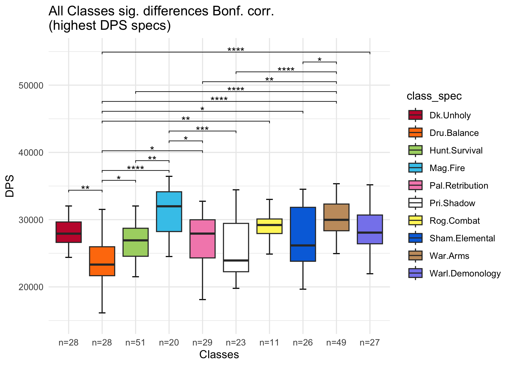<!-- -->

## Comparing DPS values based on individual Guild Membership

``` r
# reorder guild factor levels
df_dps$guild <- factor(df_dps$guild, levels=c("No Guild", "Below Average", "GG", "Illusion", 
                                                      "Prime", "Spice", "Wheelchair Raiders"))
```

#### Summary Statistics: DPS values for each Guild

| guild              | variable |   n |     mean |       sd |
|:-------------------|:---------|----:|---------:|---------:|
| No Guild           | DPS      | 112 | 27453.35 | 4221.959 |
| Below Average      | DPS      |  17 | 25626.46 | 2979.610 |
| GG                 | DPS      |  30 | 26666.79 | 3209.309 |
| Illusion           | DPS      |  67 | 29106.61 | 4005.577 |
| Prime              | DPS      |  39 | 26266.86 | 2881.688 |
| Spice              | DPS      |  46 | 26633.82 | 4255.778 |
| Wheelchair Raiders | DPS      |  64 | 27672.57 | 4662.651 |

#### Summary Statistics: Average Item-Level for each Guild

| guild              | variable |   n |    mean |    sd |
|:-------------------|:---------|----:|--------:|------:|
| No Guild           | itemlvl  | 112 | 384.839 | 3.811 |
| Below Average      | itemlvl  |  17 | 382.471 | 3.814 |
| GG                 | itemlvl  |  30 | 383.545 | 4.674 |
| Illusion           | itemlvl  |  67 | 385.900 | 5.048 |
| Prime              | itemlvl  |  39 | 382.093 | 4.635 |
| Spice              | itemlvl  |  46 | 383.808 | 5.288 |
| Wheelchair Raiders | itemlvl  |  64 | 385.751 | 4.068 |

``` r
colPalette <- c("#994C00", "#E69F00", "#56B4E9", "#009E73", "#0072B2", "#D55E00", "#CC79A7")

g_names <- sum_stats_guild$guild
g_nval <- sum_stats_guild$n
                      
df_dps %>% 
  ggplot( aes(x=guild, y=DPS, fill=guild)) +
  stat_boxplot(geom="errorbar", width=0.2) +
  geom_boxplot() +
  scale_fill_manual(values=colPalette) +
  geom_jitter(color="black", size=0.4, alpha=0.4) +
  ggtitle("Comparing DPS based on guild membership \n(all DPS specs)") +
  xlab("Guilds") +
  scale_x_discrete(labels=unlist(lapply(g_nval, function(x) {paste0("n=",x)}))) +
  labs(fill="Guilds") +
  theme_classic()
```

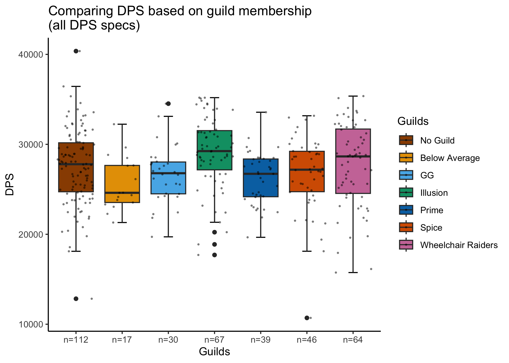<!-- -->

``` r
# checking homogeneity of regression slopes 
anova(aov(formula=DPS ~ guild * itemlvl, data=df_dps))
```

    ## Analysis of Variance Table
    ## 
    ## Response: DPS
    ##                Df     Sum Sq    Mean Sq  F value    Pr(>F)    
    ## guild           6  346789549   57798258   5.7876 9.031e-06 ***
    ## itemlvl         1 2235882616 2235882616 223.8871 < 2.2e-16 ***
    ## guild:itemlvl   6  137411085   22901847   2.2932   0.03472 *  
    ## Residuals     361 3605181465    9986652                       
    ## ---
    ## Signif. codes:  0 '***' 0.001 '**' 0.01 '*' 0.05 '.' 0.1 ' ' 1

Sig. interaction term -\> switching to multiple regression model

``` r
# comparing model fit for ancova and multiple regression models
ancova   <- lm(DPS ~ guild + itemlvl, data=df_dps)
mult_reg <- lm(DPS ~ guild * itemlvl, data=df_dps)
anova(ancova, mult_reg) 
```

    ## Analysis of Variance Table
    ## 
    ## Model 1: DPS ~ guild + itemlvl
    ## Model 2: DPS ~ guild * itemlvl
    ##   Res.Df        RSS Df Sum of Sq      F  Pr(>F)  
    ## 1    367 3742592549                              
    ## 2    361 3605181465  6 137411085 2.2932 0.03472 *
    ## ---
    ## Signif. codes:  0 '***' 0.001 '**' 0.01 '*' 0.05 '.' 0.1 ' ' 1

Sig. improvement of model fit when allowing for interaction (ancova vs
mult reg)

#### Omnibus Test:

1.  Null (Main Effect Guild) = mean DPS does not differ between guilds
2.  Null (Main Effect Item-Level) = mean Item-Level does not differ
    between guilds
3.  Null (Interaction) = mean DPS does not differ between guilds for
    different values of Item-Level

``` r
# results
anova(mult_reg)
```

    ## Analysis of Variance Table
    ## 
    ## Response: DPS
    ##                Df     Sum Sq    Mean Sq  F value    Pr(>F)    
    ## guild           6  346789549   57798258   5.7876 9.031e-06 ***
    ## itemlvl         1 2235882616 2235882616 223.8871 < 2.2e-16 ***
    ## guild:itemlvl   6  137411085   22901847   2.2932   0.03472 *  
    ## Residuals     361 3605181465    9986652                       
    ## ---
    ## Signif. codes:  0 '***' 0.001 '**' 0.01 '*' 0.05 '.' 0.1 ' ' 1

``` r
# create residual vs. fitted plot
suppressPackageStartupMessages(library(lmtest))

plot(fitted(mult_reg), resid(mult_reg), xlab="Fitted Values", ylab="Residuals")
abline(0,0)
```

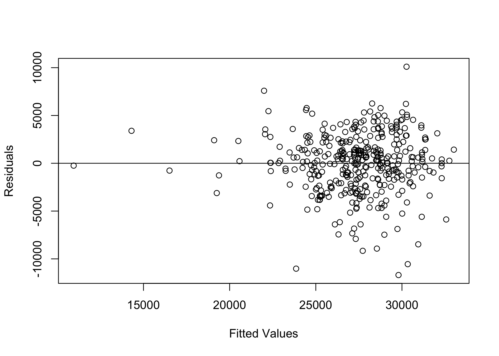<!-- -->

``` r
# perform Breusch-Pagan test to check for Homoscedasticity
# tests null hypothesis that residuals are distributed with equal variances
bptest(mult_reg)
```

    ## 
    ##  studentized Breusch-Pagan test
    ## 
    ## data:  mult_reg
    ## BP = 16.407, df = 13, p-value = 0.2279

``` r
# QQ Plots (checking normality of distribution for each factor level)
ggqqplot(df_dps, "DPS", facet.by="guild", size=0.3)
```

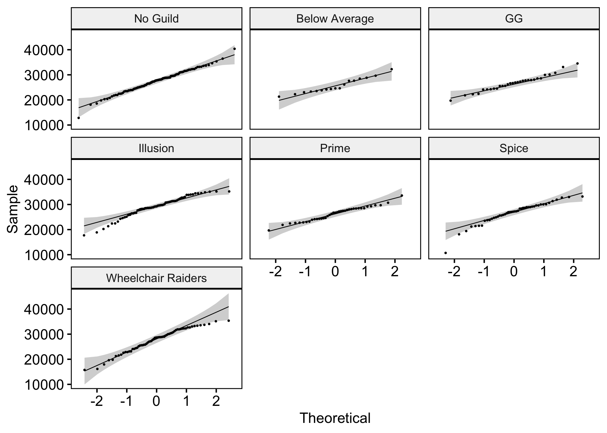<!-- -->

#### Post Hoc Pairwise Comparisons (Bonferroni corrected): Differences in Mean DPS between Guilds

(Main Effect Guilds)

| .y. | group1        | group2             |  n1 |  n2 |        p | p.signif |  p.adj | p.adj.signif |
|:----|:--------------|:-------------------|----:|----:|---------:|:---------|-------:|:-------------|
| DPS | No Guild      | Below Average      | 112 |  17 | 0.082500 | ns       | 1.0000 | ns           |
| DPS | No Guild      | GG                 | 112 |  30 | 0.343000 | ns       | 1.0000 | ns           |
| DPS | Below Average | GG                 |  17 |  30 | 0.396000 | ns       | 1.0000 | ns           |
| DPS | No Guild      | Illusion           | 112 |  67 | 0.008260 | \*\*     | 0.1730 | ns           |
| DPS | Below Average | Illusion           |  17 |  67 | 0.001600 | \*\*     | 0.0336 | \*           |
| DPS | GG            | Illusion           |  30 |  67 | 0.006150 | \*\*     | 0.1290 | ns           |
| DPS | No Guild      | Prime              | 112 |  39 | 0.114000 | ns       | 1.0000 | ns           |
| DPS | Below Average | Prime              |  17 |  39 | 0.585000 | ns       | 1.0000 | ns           |
| DPS | GG            | Prime              |  30 |  39 | 0.683000 | ns       | 1.0000 | ns           |
| DPS | Illusion      | Prime              |  67 |  39 | 0.000526 | \*\*\*   | 0.0110 | \*           |
| DPS | No Guild      | Spice              | 112 |  46 | 0.246000 | ns       | 1.0000 | ns           |
| DPS | Below Average | Spice              |  17 |  46 | 0.379000 | ns       | 1.0000 | ns           |
| DPS | GG            | Spice              |  30 |  46 | 0.972000 | ns       | 1.0000 | ns           |
| DPS | Illusion      | Spice              |  67 |  46 | 0.001470 | \*\*     | 0.0309 | \*           |
| DPS | Prime         | Spice              |  39 |  46 | 0.676000 | ns       | 1.0000 | ns           |
| DPS | No Guild      | Wheelchair Raiders | 112 |  64 | 0.729000 | ns       | 1.0000 | ns           |
| DPS | Below Average | Wheelchair Raiders |  17 |  64 | 0.063600 | ns       | 1.0000 | ns           |
| DPS | GG            | Wheelchair Raiders |  30 |  64 | 0.260000 | ns       | 1.0000 | ns           |
| DPS | Illusion      | Wheelchair Raiders |  67 |  64 | 0.042500 | \*       | 0.8930 | ns           |
| DPS | Prime         | Wheelchair Raiders |  39 |  64 | 0.086900 | ns       | 1.0000 | ns           |
| DPS | Spice         | Wheelchair Raiders |  46 |  64 | 0.183000 | ns       | 1.0000 | ns           |

``` r
# boxplots with sig. differences

# list of vectors containing all sig. comparisons
group1_guild          <- post_hoc_guild$group1[post_hoc_guild$p.adj<.05]
group2_guild          <- post_hoc_guild$group2[post_hoc_guild$p.adj<.05]
comparison_list_guild <- unname(mapply(function(x,y) {c(x,y)}, x=group1_guild, y=group2_guild, SIMPLIFY = FALSE))

pval_guild        <- post_hoc_guild$p.adj[post_hoc_guild$p.adj<.05]
pval_star_guild   <- post_hoc_guild$p.adj.signif[post_hoc_guild$p.adj<.05]

df_dps %>%
  ggplot( aes(x=guild, y=DPS, fill=guild)) +
  stat_boxplot(geom="errorbar", width=0.2) +
  geom_boxplot(outlier.alpha=0) +
  scale_fill_manual(values=colPalette) +
  geom_signif(
    comparisons=comparison_list_guild,
    annotations=pval_star_guild,
    vjust=0.7,
    y_position=c(35000, 36500, 38000),
    size=0.6,
    tip_length=0.02
  ) +
  ggtitle("Comparing DPS based on guild membership \n(all DPS specs)") +
  xlab("Guilds") +
  scale_x_discrete(labels=unlist(lapply(g_nval, function(x) {paste0("n=",x)}))) +
  labs(fill="Guilds") +
  theme_classic()
```

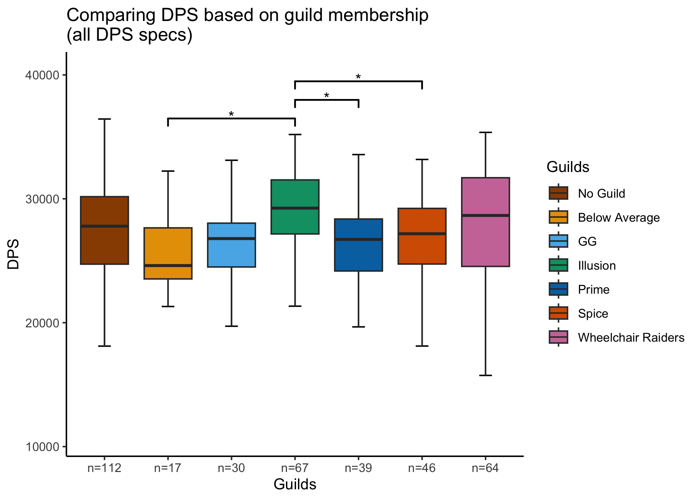<!-- -->

## Comparing Average Item-Level based on individual Guild Membership

``` r
# plotting itemlvl differences for comparisons

df_dps %>%
  ggplot( aes(x=guild, y=itemlvl, fill=guild)) +
  stat_boxplot(geom="errorbar", width=0.2) +
  geom_boxplot() +
  scale_fill_manual(values=colPalette) +
  geom_jitter(color="black", size=0.4, alpha=0.4) +
  ggtitle("Comparing average item level based on guild membership \n(all DPS specs)") +
  xlab("Guilds") +
  ylab("Avg. Item lvl") +
  scale_x_discrete(labels=unlist(lapply(g_nval, function(x) {paste0("n=",x)}))) +
  labs(fill="Guilds") +
  theme_classic()
```

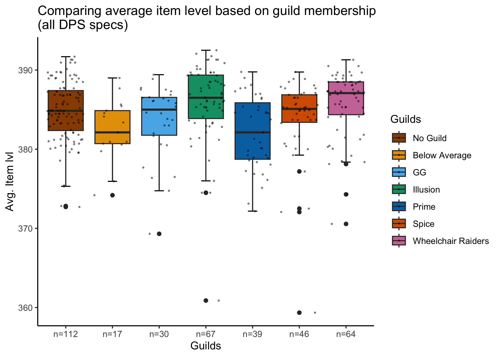<!-- -->

#### Pairwise Comparisons (Bonferroni corrected): Differences in Average Item-Level between Guilds

| .y.     | group1        | group2             |  n1 |  n2 |        p | p.signif |   p.adj | p.adj.signif |
|:--------|:--------------|:-------------------|----:|----:|---------:|:---------|--------:|:-------------|
| itemlvl | No Guild      | Below Average      | 112 |  17 | 4.15e-02 | \*       | 0.87100 | ns           |
| itemlvl | No Guild      | GG                 | 112 |  30 | 1.58e-01 | ns       | 1.00000 | ns           |
| itemlvl | Below Average | GG                 |  17 |  30 | 4.27e-01 | ns       | 1.00000 | ns           |
| itemlvl | No Guild      | Illusion           | 112 |  67 | 1.23e-01 | ns       | 1.00000 | ns           |
| itemlvl | Below Average | Illusion           |  17 |  67 | 4.77e-03 | \*\*     | 0.10000 | ns           |
| itemlvl | GG            | Illusion           |  30 |  67 | 1.64e-02 | \*       | 0.34500 | ns           |
| itemlvl | No Guild      | Prime              | 112 |  39 | 9.85e-04 | \*\*\*   | 0.02070 | \*           |
| itemlvl | Below Average | Prime              |  17 |  39 | 7.70e-01 | ns       | 1.00000 | ns           |
| itemlvl | GG            | Prime              |  30 |  39 | 1.80e-01 | ns       | 1.00000 | ns           |
| itemlvl | Illusion      | Prime              |  67 |  39 | 2.71e-05 | \*\*\*\* | 0.00057 | \*\*\*       |
| itemlvl | No Guild      | Spice              | 112 |  46 | 1.86e-01 | ns       | 1.00000 | ns           |
| itemlvl | Below Average | Spice              |  17 |  46 | 2.90e-01 | ns       | 1.00000 | ns           |
| itemlvl | GG            | Spice              |  30 |  46 | 8.01e-01 | ns       | 1.00000 | ns           |
| itemlvl | Illusion      | Spice              |  67 |  46 | 1.45e-02 | \*       | 0.30400 | ns           |
| itemlvl | Prime         | Spice              |  39 |  46 | 7.73e-02 | ns       | 1.00000 | ns           |
| itemlvl | No Guild      | Wheelchair Raiders | 112 |  64 | 1.92e-01 | ns       | 1.00000 | ns           |
| itemlvl | Below Average | Wheelchair Raiders |  17 |  64 | 7.20e-03 | \*\*     | 0.15100 | ns           |
| itemlvl | GG            | Wheelchair Raiders |  30 |  64 | 2.56e-02 | \*       | 0.53800 | ns           |
| itemlvl | Illusion      | Wheelchair Raiders |  67 |  64 | 8.48e-01 | ns       | 1.00000 | ns           |
| itemlvl | Prime         | Wheelchair Raiders |  39 |  64 | 6.29e-05 | \*\*\*\* | 0.00132 | \*\*         |
| itemlvl | Spice         | Wheelchair Raiders |  46 |  64 | 2.44e-02 | \*       | 0.51300 | ns           |

``` r
# boxplots with sig. differences of itemlvl

# create list of vectors containing all sig. comparisons
group1_guild_ilvl          <- post_hoc_guild_ilvl$group1[post_hoc_guild_ilvl$p.adj<.05]
group2_guild_ilvl          <- post_hoc_guild_ilvl$group2[post_hoc_guild_ilvl$p.adj<.05]
comparison_list_guild_ilvl <- unname(mapply(function(x,y) {c(x,y)}, x=group1_guild_ilvl, y=group2_guild_ilvl, SIMPLIFY = FALSE))

pval_star_guild_ilvl   <- post_hoc_guild_ilvl$p.adj.signif[post_hoc_guild_ilvl$p.adj<.05]

df_dps %>%
  ggplot( aes(x=guild, y=itemlvl, fill=guild)) +
  ylim(360,400) +
  stat_boxplot(geom="errorbar", width=0.2) +
  scale_fill_manual(values=colPalette) +
  geom_boxplot(outlier.alpha=0) +
  geom_signif(
    comparisons=comparison_list_guild_ilvl,
    annotations=pval_star_guild_ilvl,
    vjust=0.7,
    y_position=c(394,396,398),
    size=0.6,
    tip_length=0.02
    ) +
  ggtitle("Comparing average item level based on guild membership (Bonferroni corrected) \n(all DPS specs)") +
  xlab("Guilds") +
  ylab("Avg. Item lvl") +
  labs(fill="Guilds") +
  scale_x_discrete(labels=unlist(lapply(g_nval, function(x) {paste0("n=",x)}))) +
  theme_classic()
```

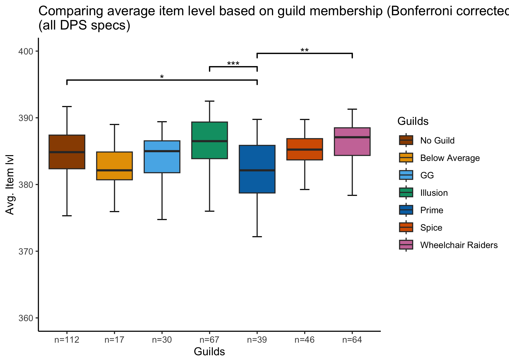<!-- -->

## Visualizing Interaction Effect of Item-Level and Guild Membership on DPS

``` r
correl <- cor.test(df_dps$DPS,df_dps$itemlvl)
correl
```

    ## 
    ##  Pearson's product-moment correlation
    ## 
    ## data:  df_dps$DPS and df_dps$itemlvl
    ## t = 15.589, df = 373, p-value < 2.2e-16
    ## alternative hypothesis: true correlation is not equal to 0
    ## 95 percent confidence interval:
    ##  0.5626058 0.6857436
    ## sample estimates:
    ##       cor 
    ## 0.6280909

``` r
# scatterplot: relationship between item level and guild membership to DPS

df_dps %>% 
  ggplot() +
  geom_point( aes(x=itemlvl, y=DPS, fill=guild, color=guild), size=1) +
  scale_color_manual(values=colPalette) +
  labs(color="Guilds") +
  geom_smooth( aes(x=itemlvl, y=DPS), method="lm", se=FALSE, color="black", size=0.5) +
  annotate(geom="text", label=paste0("DPS ~ Item Level \n(r=", round(correl$estimate, 2), ")***"), 
           x=366, y=20000, size=3, color="black") +
  ggtitle("Relationship of guild membership and item level to DPS") +
  xlab("Average Item Level") +
  guides(fill=FALSE) +
  theme_classic()
```

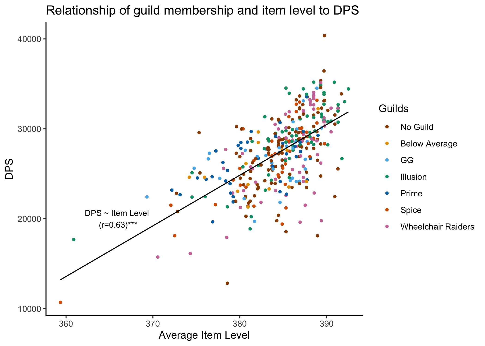<!-- -->

``` r
# scatterplot with abline for each guild with its own geom_smooth (should be possible by putting the aesthetics back into ggplot())
# + using facet_wrap()
df_dps %>% 
  ggplot( aes(x=itemlvl, y=DPS, fill=guild, color=guild)) +
  geom_point(size=1) +
  scale_color_manual(values=colPalette) +
  labs(color="Guilds") +
  geom_smooth(method="lm", se=FALSE, size=0.5, color="black") +
  ggtitle("Relationship of guild membership and item level to DPS") +
  xlab("Average Item Level") +
  guides(fill=FALSE) +
  facet_wrap(~guild, nrow=2, as.table=FALSE) +
  theme_classic()
```

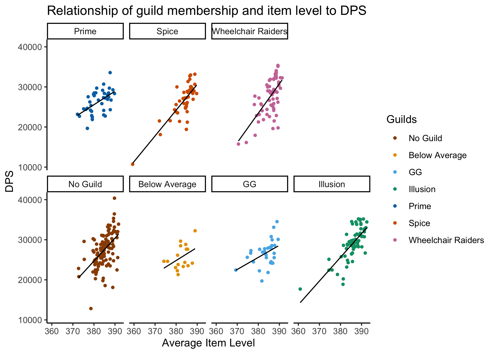<!-- -->
